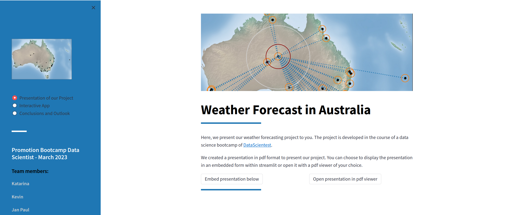
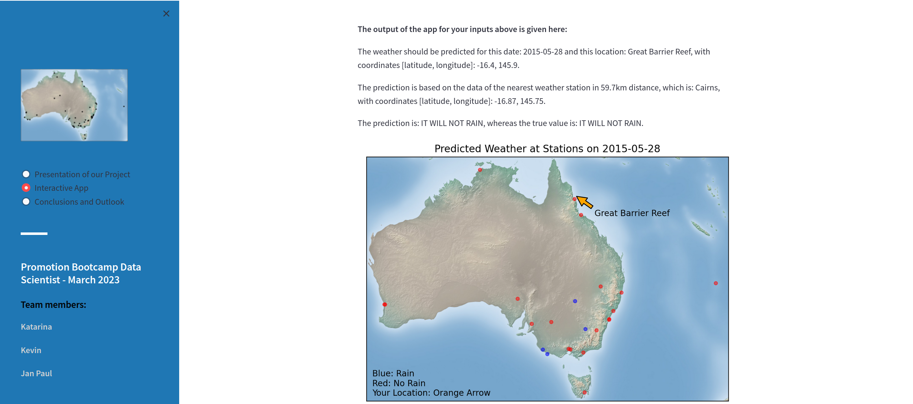
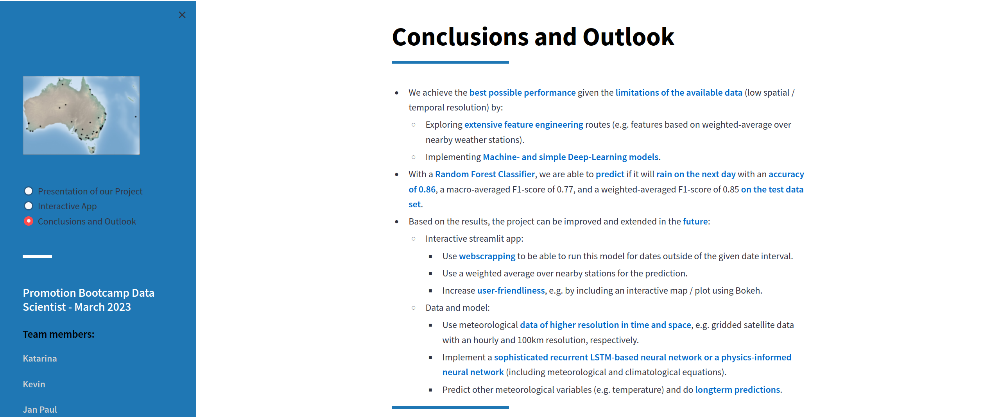

# Weather Forecast for Australia

This project is for study and scientific purposes only.

## Introduction and General Information

This is our first data science project in the course of a data science bootcamp of [DataScientest](https://datascientest.com/).
The project is conducted in parallel to the lectures of the bootcamp and roughly covers 120h of work per team member.

This project aims at predicting if it will rain on the following day at several weather stations located all around Australia.
Daily and half-daily variables are used and an extensive feature engineering is developed to improve the performance of the weather prediction.

Details on goals, methods and results of this project can be found in the [final report](./final_report.md) located in the same directory.

The project is developed by Katarina (dr-kata), Kevin (kr-blk), and Jan Paul (dr-jpk) (also Hany (Hsalah2023) contributed to parts of the first report).

## Code
You can browse and run the [notebooks](./notebooks). 

The final version of the preprocessing used on the data in the [data directory](./data) is accessible here:
[preprocessing](./notebooks/data_preprocessing_JP.py).

A script for visualizing the data and doing a data audit is given here: [visualization](./notebooks/data_visualization_and_audit_JP.py).

One of the modeling programs can be found here: [modeling](./notebooks/data_modeling_JP.py). It uses the preprocessing function of the previously mentioned python script.

Finally, a first version of an interactive app can be used by running this python script: [app](./notebooks/app_JP.py), which is also used for the Streamlit app.

You will need to install the dependencies (in a dedicated environment):

```shell
cd this_directory
python -m venv path_to_venv/ds_project
source path_to_venv/ds_project/bin/activate
pip install -r requirements.txt

```

You can also use an anaconda environment instead of venv:

```shell
cd this_directory
conda create --name ds_project python=3.10
conda activate ds_project
pip install -r requirements.txt
```

## Streamlit App
### Description
A [Streamlit](https://streamlit.io/) application including a presentation of the project and an interactive demo is available in the [streamlit_app](streamlit_app) directory. You can use this application to get an interactive experience of our project.
### Preview
<details>
<summary><b>Click here to expand this section with screenshots of our Streamlit app</b></summary>

Some screenshots of the Streamlit app are shown below. In a first tab, you are introduced to our project.

You can choose between displaying a pdf presentation within Streamlit or with a pdf viewer of your choice.



In the second tab of our app, you can get active and give a date and location of your choice as input.


If you press "Submit", the app will run a pretrained model on your inputs and tell you, if it is going to rain in your location on the next day.



In the final tab, we present the most important conclusions of our project and give an outlook on future work.



</details>

## Using the (Streamlit) App

To be able to run both the python [app](./notebooks/app_JP.py) and the [streamlit_app](streamlit_app), you need to take the following steps:

0. **Read and comply with the licenses**:
    1. The data we used in this project is from a [kaggle dataset](https://www.kaggle.com/datasets/jsphyg/weather-dataset-rattle-package), which is under the license of the Commonwealth of Australia, Bureau of Meteorology (BOM) quoting the [kaggle website](https://www.kaggle.com/datasets/jsphyg/weather-dataset-rattle-package):<br><br>
    "Observations were drawn from numerous weather stations. The daily observations are available from http://www.bom.gov.au/climate/data.<br>
An example of latest weather observations in Canberra: http://www.bom.gov.au/climate/dwo/IDCJDW2801.latest.shtml<br><br>Definitions adapted from http://www.bom.gov.au/climate/dwo/IDCJDW0000.shtml<br>Data source: http://www.bom.gov.au/climate/dwo/ and http://www.bom.gov.au/climate/data.<br><br>Copyright Commonwealth of Australia 2010, Bureau of Meteorology."<br><br>
    Copyright and license according to BOM (direct download of an example dataset for one station and one month):<br><br>"Copyright of Bureau of Meteorology materials resides with the Commonwealth of Australia. Apart from any fair dealing for purposes of study, research, criticism and review, as permitted under copyright legislation, no part of this product may be reproduced, re-used or redistributed for any commercial purpose whatsoever, or distributed to a third party for such purpose, without written permission from the Director of Meteorology."
    1. The license of our project can be found here [LICENSE](LICENSE)
0. **Dependencies**:<br>Install the dependencies (in a dedicated environment as discussed in [Code](#Code)):<br>`pip install -r requirements.txt`
0. **Data**:<br>The data is not included in this repository and a placeholder file [weatherAUS.csv](data/weatherAUS.csv) has to be replaced by the real data. We used the kaggle dataset which can be downloaded [here](https://www.kaggle.com/datasets/jsphyg/weather-dataset-rattle-package).
0. Go to the notebooks directory:<br>`cd notebooks`
0. **Preprocessing**:<br>Run the preprocessing script to create pkl files with preprocessed data:<br>`python data_preprocessing_JP.py`
0. **Modeling**:<br>Run the modeling script to create a pkl file with the pretrained model:<br>`python data_modeling_JP.py`
0. **Apps**:
    1. **python app**:<br>run the python app and give a date and location when asked to test the model: `python app_JP.py`
    1. **Streamlit app**:
        1. Go to the streamlit directory:<br>`cd ../streamlit_app`
        1. run the Streamlit app:<br>`streamlit run app.py`<br>The app should then be available at [localhost:8501](http://localhost:8501).
