# Final report
- [Introduction to the project](#Introduction-to-the-project)
    - [Context](#Context)
    - [Objectives for Phase I](#Objectives-for-Phase-I)
    - [Executive Team](#Executive-Team)
- [Understanding and manipulating data](#Understanding-and-manipulating-data)
    - [Framework](#Framework)
    - [Relevance](#Relevance)
    - [Preprocessing and feature engineering](#Preprocessing-and-feature-engineering)
    - [data audit](#data-audit)
    - [Visualizations and Statistics](#Visualizations-and-Statistics)
- [Modeling and solving the problem using Machine Learning techniques](#Modeling-and-solving-the-problem-using-Machine-Learning-techniques)
    - [Classification of the problem](#Classification-of-the-problem)
    - [Model choice and optimization](#Model-choice-and-optimization)
    - [Results](#Results)
        - [Logistic Regression](#Logistic-Regression)
        - [Support Vector Machine (SVM)](#Support-Vector-Machine-(SVM))
        - [RandomForestClassifier](#RandomForestClassifier)
            - [Bagging for RandomForestClassifier](#Bagging-for-RandomForestClassifier)
        - [Gaussian Naive Bayes](#Gaussian-Naive-Bayes)
        - [Deep Learning - Keras](#Deep-Learning---Keras)
        - [Best Model - Random Forest Classifier](#Best-Model---Random-Forest-Classifier)
            - [Random Forest using only most important features as input](#Random-Forest-using-only-most-important-features-as-input)
    - [Conclusions from all models](#Conclusions-from-all-models)
    - [Proposal for further feature engineering - including data from nearby stations](#Proposal-for-further-feature-engineering---including-data-from-nearby-stations)
- [Further modeling after rethinking the preprocessing](#Further-modeling-after-rethinking-the-preprocessing)
    - [Preprocessing constellations and data selections](#Preprocessing-constellations-and-data-selections)
    - [New preprocessing results](#New-preprocessing-results)
        - [SVM](#SVM)
        - [Logistic Regression](#Logistic-Regression)
        - [Keras for MelbourneAirport](#Keras-for-MelbourneAirport)
        - [after modify the data loading part and update the input dimension in the Keras](#after-modify-the-data-loading-part-and-update-the-input-dimension-in-the-Keras)
        - [Random Forest Classifier](#Random-Forest-Classifier)
        - [Short Summary of all Models](#Short-Summary-of-all-Models)
- [Conclusions and Outlook](#Conclusions-and-Outlook)

## Introduction to the project
### Context
Our executive team represents the founders of **Weather of the Future**, a newly
established and fast-growing startup company specialized in developing B2B
weather forecasting systems for Australian clients.

We will provide our clients with customizable, efficient, reliable, and highly accurate
long-term predictions of different weather metrics across Australia, by leveraging AI
and mathematical techniques for the analysis of historical time series data, and/or
recurrent neural networks.

The niche markets that we are planning to cover include but are not limited to
agricultural businesses, insurance companies, energy distribution companies and
airlines, being sectors that rely heavily on future weather predictions to plan their
business operations.

Hence, from an economic/business standpoint, the development of various weather
forecasting and prediction systems will be at the very core of our business model,
being the main source of revenue through the sales of customized products and/or
forecasts to our targeted clients.

Our initial long-term goal is to provide our clients, business partners and other
possible stakeholders with comprehensive and customizable weather prediction
services that cover all the metrics and variables of daily weather conditions, including
the likelihood of rainfall, temperatures and wind activity, in addition to other more
advanced variables.

However, phase I of our project will be dedicated to developing forecast systems
chiefly to predict daily rainfall, as we simultaneously market our services to more
clients who require more sophisticated and complex weather forecasting systems
covering more complex variables.

We aim to employ and consult with a wide variety of resources to use in training
our data, in order to produce systems and forecasts that remain relevant and valid
from a technical and scientific standpoints as well.

From a technical point of view, we will initially utilize daily weather data from federal
Bureau of Meteorology [BOM](http://www.bom.gov.au/) of Australia. We will also rely on data from a
dozens of weather stations giving us datapoints every day. Our computing resources
are limited (for now) to laptops, so very detailed and data rich forecasts are not
feasible.

It is worth noting, that since weather prediction is a multidisciplinary subject,
spanning various domains, including meteorology, geography, and physics, and
given also that Earth is undergoing global warming and climate change, our models
will not rely solely on historical and technical data, but will also consider and rely on
up-to-date findings and developments published in reputable academic publications
and research papers in the related scientific fields which include meteorology,
geography, and physics.

### Objectives for Phase I
Our short-term objectives are as follows:

Acquire clients from the aforementioned business sectors who mainly need forecasts
for daily rainfall predictions.

Gradually increase quality and detail of weather forecasts for our clients, mainly
regarding the likelihood of rainfall as a first stage, where it will be predicted whether
there will or will not be rain on the next day for each location we have weather data
for (yes/no, 1 day, fixed locations).

Forecasts will be based on the given kaggle dataset (for now).We might possibly
also compare performance with data from recent months (e.g. train on data up to
2017 and predict weather for 11.2022 - 04.2023)

depending on success and data availability: specialize in more fields, e.g. long-term
(up to 2 week) forecast of thunderstorm / flood probability

Further steps might include predictions for locations that are not present in the
dataset. This might require:

- longitude and latitude of each weather station, calculate distance and nearest station to approximate weather at random location
- wind direction (approx. travel direction of current weather)

Longer term predictions of up to two weeks will require:

- redefine binary target variable from RainTomorrow to rain within next two weeks
- precise prediction of amount of rain [mm] on the next day (and longer term). Requires:
- redefine binary target variable to numerical/quantitative variable (possible via Rainfall variable)
- predict amount of sunshine / temperatures / wind speeds and directions...
- add more weather station data (larger temporal or spatial range) to improve weather forecasts
- create a plot of a weather map showing weather forecast for provided stations, or a heatmap for rain amount / sunshine etc. (e.g. using bokeh?)
- create a GUI or terminal tool for the user to put in a date and location to get our weather forecast for these input data

### Executive Team
- Katarina:
    - scientist with a passion for technical innovation
    - Ph.D. in materials science (recycling magnetic materials)
    - experience in management of scientific projects (national and international)
- Hany:
     - ten-year Corporate Banking experience as Credit Officer for large corporates
    - experience in financial time series analysis for corporates and building future financial projections accordingly.

- Kevin:
    - Knowledge, and experience in mathematical modeling.
- Jan Paul:
    - physicist: background knowledge in the physics involved in meteorology
    - programming experience
    - experience in writing scientific reports

- none of us has experience in
    - weather forecast. Hany has some kind of experience in temporal forecasts
    - machine / deep learning

## Understanding and manipulating data
### Framework
- Used datasets:
    - first we will only use the kaggle dataset provided and get longitude/latitude/elevation information of weather stations (corresponding to Locations given in the kaggle dataset) from the [BOM website](http://www.bom.gov.au/climate/data/)
    - we might extend the dataset in the future based on the BOM website:
         - include more weather stations
         - extend the time period
         
- Copyright and Licensing of the dataset:
     - the kaggle dataset we use is under the license of BOM quoting the [kaggle website](https://www.kaggle.com/datasets/jsphyg/weather-dataset-rattle-package):
        > "Observations were drawn from numerous weather stations. The daily observations are available from http://www.bom.gov.au/climate/data.
An example of latest weather observations in Canberra: http://www.bom.gov.au/climate/dwo/IDCJDW2801.latest.shtml 
        > Definitions adapted from http://www.bom.gov.au/climate/dwo/IDCJDW0000.shtml 
        > Data source: http://www.bom.gov.au/climate/dwo/ and http://www.bom.gov.au/climate/data.
        > Copyright Commonwealth of Australia 2010, Bureau of Meteorology."
    - copyright and license according to BOM (direct download of an example dataset for one station and one month):
        > "Copyright of Bureau of Meteorology materials resides with the Commonwealth of Australia. Apart from any fair dealing for purposes of study, research, criticism and review, as permitted under copyright legislation, no part of this product may be reproduced, re-used or redistributed for any commercial purpose whatsoever, or distributed to a third party for such purpose, without written permission from the Director of Meteorology."
- Volume of our dataset:
    - 14MB of (dominantly) numeric data
    - 23 variables with about about 150k entries / observations
    - 49 different weather stations

### Relevance
In order to reach our objective, we decided that the most relevant variables are, the
Location, Rainfall, Sunshine, WindGustSpeed, Humidity9am/3pm, Cloud 9am/3pm and
RainToday.

As for the target variable we will focus on the RainTomorrow variable for the moment.

The data analyses, and our data visualisation allowed us to see a strong correlation between
the 9am/3pm variables, as well as the Min/MaxTemp, which is explained by this datas being
from the same day. We also noticed that the temperature of Australia is at its lowest around
June when the winter starts, which indicates a cycle of seasons in Australia.

Some of the feature variables that will be used to predict our model have close to 50% of
their values missing, which includes the Cloud 9am/3pm variable who is one of our relevant
variables. We are planning to replace these missing values by the mean, but the great
number of missing values requires us to handle these values cautiously.

The data collected are limited to 49 locations, and only have a time range going from 2008 to
2017.

Gridded data (e.g radar), might be an option later on in order to improve our rain prediction
model, but it is also computationally more taxing.

### Preprocessing and feature engineering
- take care around missing values: according to [BOM](http://www.bom.gov.au/climate/dwo/IDCJDW0000.shtml):
> "These observations have been taken from the Bureau of Meteorology's "real time" system. Most of the data are generated and handled automatically. Some quality checking has been performed, but it is still possible for erroneous values to appear. 
> From time to time, observations will not be available, for a variety of reasons. Sometimes when the daily maximum and minimum temperatures, rainfall or evaporation are missing, the next value given has been accumulated over several days rather than the normal one day. It is very difficult for an automatic system to detect this reliably, so caution is advised."

In preprocessing, several steps can be taken to ensure the data is ready for analysis and
prediction.

Cleaning the data can be done by checking for missing values, duplicates, and outliers. And
also, by removing or imputing missing values, removing duplicates, and handling outliers
based on domain knowledge.

We did not find any duplicates in the dataset.

There are no apparent outliers visible in the data audit table below (column "distribution").

For the following variables, the data cleaning has been done as such,

- Date:
    - change variable type from object to datetime: as this object is a date of format
    - **feature engineering** split date on three different new variables: year, month, day
        - this helps to model the seasons in Australia (summer/winter differences)
- Location:
     - Remove the weather stations Katherine, Nhil, Uluru, since they have way less entries than the others: only about 50% (1578 entries for each of those three stations versus 3000 to 3500 for the other stations (others are fine).
     - **feature engineering**: add variables to the dataset that describe the `Location` variable in a better way (all are obtained from the [BOM website](http://www.bom.gov.au/climate/data/)):
         - `NearestBureauStationNr`: for each of the 49 Locations given in the dataset, we searched for a corresponding weather station on the website, this variable is the unique identifier of the weather station that seems to be related to the Location (sometimes a Location given in the dataset is not clearly identifiable, in that case we chose the weather station that seemed to match best (such issues occurred with Location: Richmond, Mount Ginini, Portland, PearceRAAF, Perth)). For Richmond (both, *richmond RAAF 067105  33.60 150.78 19* and *richmond post office 030045 20.73 143.14  211* seemed to be reasonable candidates, we chose station 067105)
        - `Location_Latitude`: the latitude of the station position in degrees
        - `Location_Longitude`: the longitude of the station position in degrees
        - `Location_Elevation`: the altitude of the station in masl
        - these new variables might allow us to improve the modeling, for instance by finding the closest station to a given longitude/latitude position in Australia.
- WindDirGust / WindDir9am / WindDir3pm, Cloud 9am/3pm:
    - Replace the missing values by the mode as this are discrete variables (windspeed in 16 compass directions and cloud coverage in octas (0-8 for blue sky - fully cloudy and 9 for "no horizon visible"/fog)).
    - **feature engineering** for wind directions:
        - Replace each of the WindDir variable entries with a numerical value between 0 and $2\pi$ (0 = North, $\pi$ = South, 16 compass directions given so use steps of $\frac{\pi}{8}$)
        - add for each of the WindDir variables two new variables indicating the direction of the wind as numerical value using a cosine and sine functions of the previously changed WindDir variables.
        - This ensures that the models can understand, that the compass directions are periodic and for instance N, NNE, and NNW are close together, while N and S are the most separated.
- RainToday/RainTomorrow:
    - Replace the values No, and Yes, by 0 and 1 respectively.
    - Drop the entries with missing values in these variables, as there are few missing values (about 2%) and we do not want to bias our target variable by replacing missing values for instance with the mode.
- MinTemp, MaxTemp, Rainfall, Evaporation, Sunshine, WindGustSpeed, WindSpeed 9am/3pm, Humidity 9am/3pm, Pressure 9am/3pm, Temp 9am/3pm:
    - Replace the missing values by the mean

Finalizing the data cleaning we remove all variables that are of no benefit for the model, which are:
    - Date: replaced by Day, Month, Year variables
    - Location: replaced by longitude, latitude and elevation coordinates
    - NearestBureauStationNr: only of interest for cross-checking or extending the data
    - WindGustDir, WindDir9am,WindDir3pm: all replaced by sine and cosine variables

Thus the cleaned dataset for modeling purposes includes the following variables:
>["Day", "Month", "Year", "Location_Latitude", "Location_Longitude", "Location_Elevation", "MinTemp", "MaxTemp", "Evaporation", "Sunshine", "WindGustSpeed", "WindGustDir_cos", "WindGustDir_sin", "WindDir9am_cos", "WindDir9am_sin", "WindDir3pm_cos", "WindDir3pm_sin", "WindSpeed9am", "WindSpeed3pm", "Humidity9am", "Humidity3pm", "Pressure9am", "Pressure3pm", "Cloud9am", "Cloud3pm", "Temp9am", "Temp3pm", "Rainfall", "RainToday", "RainTomorrow"]

After cleaning the data for our initial variables we can create new features that may be more
informative for the target variable. For example, create a new feature that combines wind
direction and wind speed.

Furthermore, for the model to perform best, we will scale and normalize the features to
ensure that all the numerical variables have the same range and are on the same scale.
Depending on the model we decide to use we should use the StandarScaler for the
numerical variables.

If necessary we can handle imbalanced data, by checking if the dataset is balanced or
imbalanced. If it is imbalanced, we can use techniques like oversampling, undersampling, or
SMOTE (Synthetic Minority Over-sampling Technique) to balance the dataset.

Through feature selection, we select the most important features for the prediction task. This can be done using techniques like correlation analysis or feature importance analysis.

We then split the data into training, validation, and test sets. This helps to evaluate the
performance of the model on unseen data.

If needed, we can normalize the target variable to ensure that it has a similar range and
distribution as the features. This can help some models to perform better.

As visible in the data audit table below, the data does not feature any exceptional outliers and the variable ranges are reasonable in terms of the expected climate conditions in Australia.

#### data audit
|   number | variable name          | target   | description                                                                             | known a priori   | data type      |   # NaNs |   % NaN | variable type               | distribution                                                                                              | Comments   |
|---------:|:-----------------------|:---------|:----------------------------------------------------------------------------------------|:-----------------|:---------------|---------:|--------:|:----------------------------|:----------------------------------------------------------------------------------------------------------|:-----------|
|        0 | Date                   | False    | [year-month-day] date of weather observation                                         | True             | datetime64[ns] |        0 |     0   | cat ord date             | - count = 145460 - min = 2007-11-01 - max = 2017-06-25                                              | convert    |
|        1 | Location               | False    | [str] inofficial name/town of weather station                                        | True             | object         |        0 |     0   | cat num should be ord | - count = 145460 - unique = 49 - top = Canberra - freq = 3436                                    | convert    |
|       23 | NearestBureauStationNr | False    | Identifier string number of weather station closest to given location                   | True             | object         |        0 |     0   | cat num                     | - count = 145460 - unique = 49 - top = 070351 - freq = 3436                                      | added      |
|       24 | Location_Latitude      | False    | [ $^{\circ}$ ] approx. latitude coordinate of given location                            | True             | float64        |        0 |     0   | num con                     | - count = 145460 - min = 12.42 - max = 42.89 - 50% = 33.95 - mean = 32.77 - std = 6.0      | added      |
|       25 | Location_Longitude     | False    | [ $^{\circ}$ ] approx. longitude coordinate of given location                           | True             | float64        |        0 |     0   | num con                     | - count = 145460 - min = 115.06 - max = 167.94 - 50% = 145.83 - mean = 142.1 - std = 12.1  | added      |
|       26 | Location_Elevation     | False    | [masl] approx. elevation coordinate of given location                                   | True             | int64          |        0 |     0   | num con                     | - count = 145460 - min = 2.0 - max = 1760.0 - 50% = 51.0 - mean = 151.65 - std = 282.39    | added      |
|        2 | MinTemp                | False    | [ $^{\circ}$ C] min T in (24h to 9am). Sometimes nearest whole degree                | True             | float64        |     1485 |     1   | num con                     | - count = 143975 - min = -8.5 - max = 33.9 - 50% = 12.0 - mean = 12.19 - std = 6.4         |            |
|        3 | MaxTemp                | False    | [ $^{\circ}$ C] max T (24h to 9am). Sometimes nearest whole degree                   | True             | float64        |     1261 |     0.9 | num con                     | - count = 144199 - min = -4.8 - max = 48.1 - 50% = 22.6 - mean = 23.22 - std = 7.12        |            |
|        5 | Evaporation            | False    | [mm] 'Class A' pan evaporation (24h to 9am)                                          | True             | float64        |    62790 |    43.2 | num con                     | - count = 82670 - min = 0.0 - max = 145.0 - 50% = 4.8 - mean = 5.47 - std = 4.19           |            |
|        6 | Sunshine               | False    | [h] Bright sunshine (24h to 0am)                                                     | True             | float64        |    69835 |    48   | num con                     | - count = 75625 - min = 0.0 - max = 14.5 - 50% = 8.4 - mean = 7.61 - std = 3.79            |            |
|        8 | WindGustSpeed          | False    | [km/h] Speed of strongest wind gust (24h to 0am)                                     | True             | float64        |    10263 |     7.1 | num con                     | - count = 135197 - min = 6.0 - max = 135.0 - 50% = 39.0 - mean = 40.04 - std = 13.61       |            |
|        7 | WindGustDir            | False    | [16 compass dirs. in radians (0 to $2\pi$)] Direction of strongest gust (24h to 0am) | True             | float64        |    10326 |     7.1 | cat ord                     | - count = 135134 - min = 0.0 - max = 5.89 - 50% = 3.14 - mean = 2.97 - std = 1.76          | convert    |
|       27 | WindGustDir_cos        | False    | [cosine of direction] for WindGustDir                                                   | True             | float64        |    10326 |     7.1 | num dis                     | - count = 135134 - min = -1.0 - max = 1.0 - 50% = 0.0 - mean = -0.05 - std = 0.7           | added      |
|       28 | WindGustDir_sin        | False    | [sine of direction] for WindGustDir                                                     | True             | float64        |    10326 |     7.1 | num dis                     | - count = 135134 - min = -1.0 - max = 1.0 - 50% = 0.0 - mean = -0.02 - std = 0.71          | added      |
|        9 | WindDir9am             | False    | [16 compass dirs. in radians (0 to $2\pi$)] averaged over 10min prior to 9am         | True             | float64        |    10566 |     7.3 | cat ord                     | - count = 134894 - min = 0.0 - max = 5.89 - 50% = 2.75 - mean = 2.85 - std = 1.83          | convert    |
|       29 | WindDir9am_cos         | False    | [cosine of direction] for WindDir9am                                                    | True             | float64        |    10566 |     7.3 | num dis                     | - count = 134894 - min = -1.0 - max = 1.0 - 50% = 0.0 - mean = 0.01 - std = 0.72           | added      |
|       30 | WindDir9am_sin         | False    | [sine of direction] for WindDir9am                                                      | True             | float64        |    10566 |     7.3 | num dis                     | - count = 134894 - min = -1.0 - max = 1.0 - 50% = 0.0 - mean = 0.02 - std = 0.69           | added      |
|       10 | WindDir3pm             | False    | [16 compass dirs. in radians (0 to $2\pi$)] averaged over 10min prior to 3pm         | True             | float64        |     4228 |     2.9 | cat ord                     | - count = 141232 - min = 0.0 - max = 5.89 - 50% = 3.14 - mean = 3.0 - std = 1.76           | convert    |
|       31 | WindDir3pm_cos         | False    | [cosine of direction] for WindDir3pm                                                    | True             | float64        |     4228 |     2.9 | num dis                     | - count = 141232 - min = -1.0 - max = 1.0 - 50% = 0.0 - mean = -0.05 - std = 0.7           | added      |
|       32 | WindDir3pm_sin         | False    | [sine of direction] for WindDir3pm                                                      | True             | float64        |     4228 |     2.9 | num dis                     | - count = 141232 - min = -1.0 - max = 1.0 - 50% = 0.0 - mean = -0.02 - std = 0.71          | added      |
|       11 | WindSpeed9am           | False    | [km/h] averaged over 10min prior to 9am                                              | True             | float64        |     1767 |     1.2 | num con                     | - count = 143693 - min = 0.0 - max = 130.0 - 50% = 13.0 - mean = 14.04 - std = 8.92        |            |
|       12 | WindSpeed3pm           | False    | [km/h] averaged over 10min prior to 3pm                                              | True             | float64        |     3062 |     2.1 | num con                     | - count = 142398 - min = 0.0 - max = 87.0 - 50% = 19.0 - mean = 18.66 - std = 8.81         |            |
|       13 | Humidity9am            | False    | [%] Relative humidity at 9am                                                         | True             | float64        |     2654 |     1.8 | num con                     | - count = 142806 - min = 0.0 - max = 100.0 - 50% = 70.0 - mean = 68.88 - std = 19.03       |            |
|       14 | Humidity3pm            | False    | [%] Relative humidity at 3pm                                                         | True             | float64        |     4507 |     3.1 | num con                     | - count = 140953 - min = 0.0 - max = 100.0 - 50% = 52.0 - mean = 51.54 - std = 20.8        |            |
|       15 | Pressure9am            | False    | [hPa] Atmospheric pressure reduced to mean sea level at 9am                          | True             | float64        |    15065 |    10.4 | num con                     | - count = 130395 - min = 980.5 - max = 1041.0 - 50% = 1017.6 - mean = 1017.65 - std = 7.11 |            |
|       16 | Pressure3pm            | False    | [hPa] Atmospheric pressure reduced to mean sea level at 3pm                          | True             | float64        |    15028 |    10.3 | num con                     | - count = 130432 - min = 977.1 - max = 1039.6 - 50% = 1015.2 - mean = 1015.26 - std = 7.04 |            |
|       17 | Cloud9am               | False    | [octas] Fraction of sky obscured by cloud at 9 am                                    | True             | float64        |    55888 |    38.4 | num dis                     | - count = 89572 - min = 0.0 - max = 9.0 - 50% = 5.0 - mean = 4.45 - std = 2.89             |            |
|       18 | Cloud3pm               | False    | [octas] Fraction of sky obscured by cloud at 3pm                                     | True             | float64        |    59358 |    40.8 | num dis                     | - count = 86102 - min = 0.0 - max = 9.0 - 50% = 5.0 - mean = 4.51 - std = 2.72             |            |
|       19 | Temp9am                | False    | [ $^{\circ}$ C] T at 9am                                                             | True             | float64        |     1767 |     1.2 | num con                     | - count = 143693 - min = -7.2 - max = 40.2 - 50% = 16.7 - mean = 16.99 - std = 6.49        |            |
|       20 | Temp3pm                | False    | [ $^{\circ}$ C] T at 3pm                                                             | True             | float64        |     3609 |     2.5 | num con                     | - count = 141851 - min = -5.4 - max = 46.7 - 50% = 21.1 - mean = 21.68 - std = 6.94        |            |
|        4 | Rainfall               | False    | [mm] Precipitation (rainfall) (24 hours to 9am). Sometimes nearest whole millimetre  | True             | float64        |     3261 |     2.2 | num con                     | - count = 142199 - min = 0.0 - max = 371.0 - 50% = 0.0 - mean = 2.36 - std = 8.48          |            |
|       21 | RainToday              | False    | 1 if precipitation (mm) (24h to 9am) exceeds 1mm, otherwise 0                           | True             | float64        |     3261 |     2.2 | cat bin                     | - count = 142199 - min = 0.0 - max = 1.0 - 50% = 0.0 - mean = 0.22 - std = 0.42            | convert    |
|       22 | RainTomorrow           | True     | 1 if precipitation (mm) (24h to 9am) exceeds 1mm, otherwise 0                           | False            | float64        |     3267 |     2.2 | cat bin                     | - count = 142193 - min = 0.0 - max = 1.0 - 50% = 0.0 - mean = 0.22 - std = 0.42            | convert    |
- number of rows and columns in dataframe : (145460, 33)

##### Description / Legend
- types of variables:
    - numerical (num)
        - discrete (dis) : finite amount of possible values
        - continuous (con) : infinite amount of possible values
    - categorical (cat)
        - ordinal (ord) : have an order
        - numerical (num) : categories without order/rank
        - binary (bin) : boolean, True or False, 0 or 1
    - date/time (stamp)
    - text
    - image
    - sound

### Visualizations and Statistics

In this first plot we depict a map of Australia and added markers at each location, for which we have weather data. The color encodes the topography. Note that there is one weather station on an island in the East of Australia (between Australia and New Zealand), which might feature a different climate zone and has to be handled with care. Furthermore, most weather stations are located in the South-West and -East of Australia, this is likely due to the higher population density in these regions.

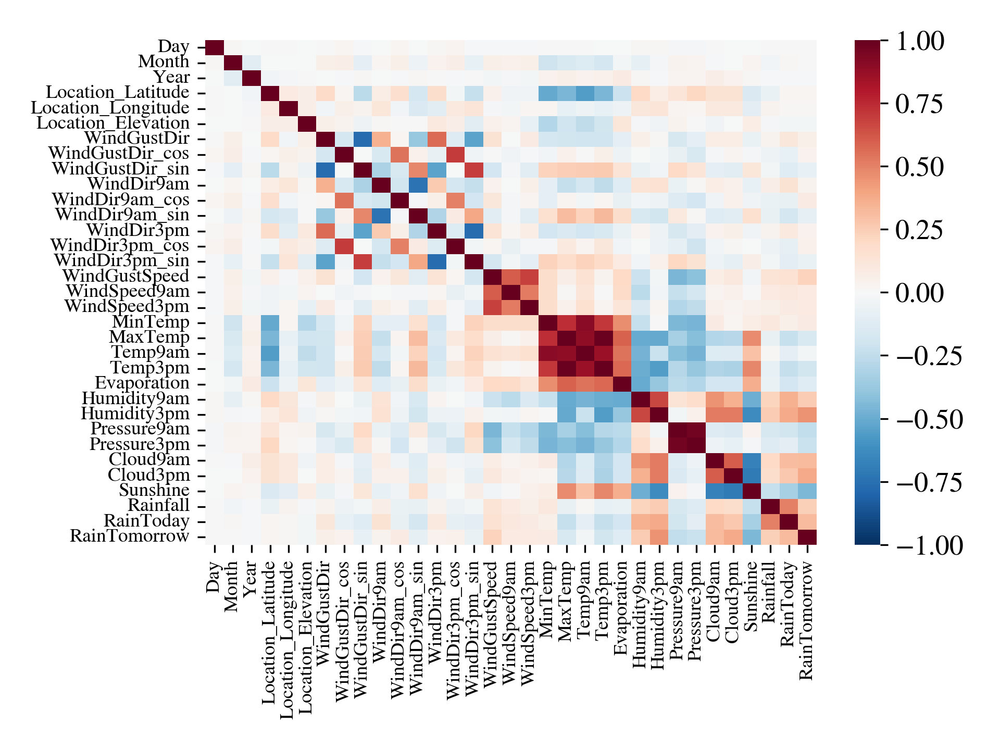

This heatmap shows the (linear) correlations between all numeric variables in our dataset. We will discuss some of the important findings here.

First, referencing to the previous plot, we find a negative correlation between the latitude of the weather station and the temperature variables. This is reasonable, because Australia is divided in different climate zones, where the North (closer to the Equator) is warm and the South cold (farther away from Equator and influence of mountain ranges / elevation), which is also discussed [here: yourhome.gov](https://www.yourhome.gov.au/getting-started/australian-climate-zones) and [here: bom.gov](http://www.bom.gov.au/climate/maps/averages/climate-classification/).

Similarly, because of physics/meteorological reasons, elevated correlations are found between the following variables: all temperatures, the evaporation, sunshine, cloud coverage, wind speed, humidity, and pressure. The strongest correlations are found between the different temperatures, as we have daily data, such that the min/max temperature and temperatures at 9am and 3pm on the same day are very likely strongly related. A particularly strong anti-correlation is found between cloud coverage and sunshine, as expected. Moreover, the variables for 9am and 3pm are correlated as the weather development during the day depends on the starting conditions in the morning. We will keep all variables for the modeling, but keep in mind to potentially merge some variables together, for instance min/max and 9am/3pm temperature, sunshine and cloud coverage, as well as 9am/3pm pressure (one could replace the 3pm variables by the result of subtracting 3pm values from 9am values, in order to encode the change/gradient of the respective variable.).

Looking at our target variable, RainTomorrow, we find most significant correlations with Sunshine, WindGustSpeed, Humidity9am/3pm, Cloud 9am/3pm, Rainfall and RainToday.

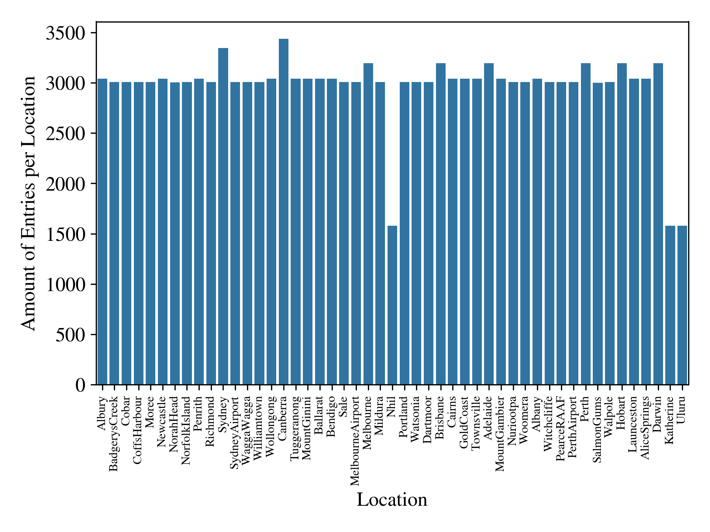

Looking at the amount of entries per location/weather station, we justify to remove data from the locations Nhil, Katherine, and Uluru, as these locations feature only half as many entries as the other locations.

Canberra and Sydney feature the most entries, likely because these are densely populated regions in Australia and the airports of these towns have to rely on consistent weather data every single day. As we have about 3000 entries for the remaining locations, we assume to have sufficient data for first modeling attempts, since this corresponds to about 10 years of daily observations.

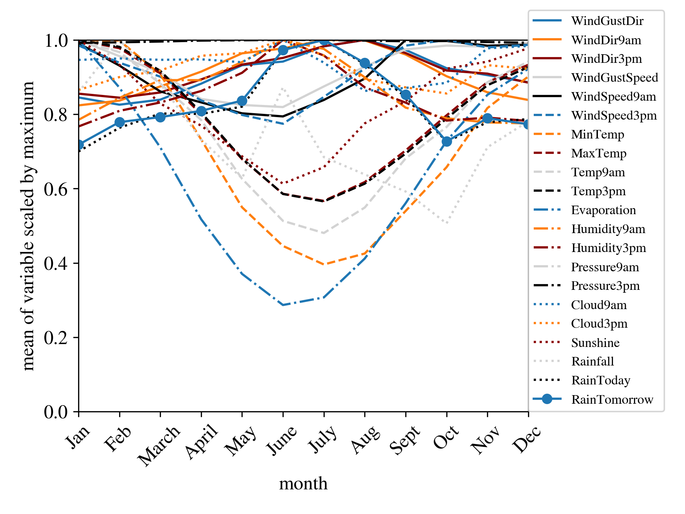

The plot of monthly averaged values of all variables shows that Australia features seasons. In difference to the Northern hemisphere, Australia has its winter months around the middle of the year with the coldest month being July. The variables changing the most over the year are evaporation, minimum temperature, temperature at 9am and 3pm, and maximum temperature. The sunshine hours also decrease during the winter months. In contrast, our target variable reaches its maximum during the winter months, indicating that Australias winter features more precipitation days than the summer. Nevertheless, the largest amount of rain falls on average in February, where the Rainfall variable has its maximum. This indicates that February features less rainy days than e.g. July, but on rainy days, there is on average much more rain falling. However, this might be biased by differences between the years, which are plotted in the following graph.

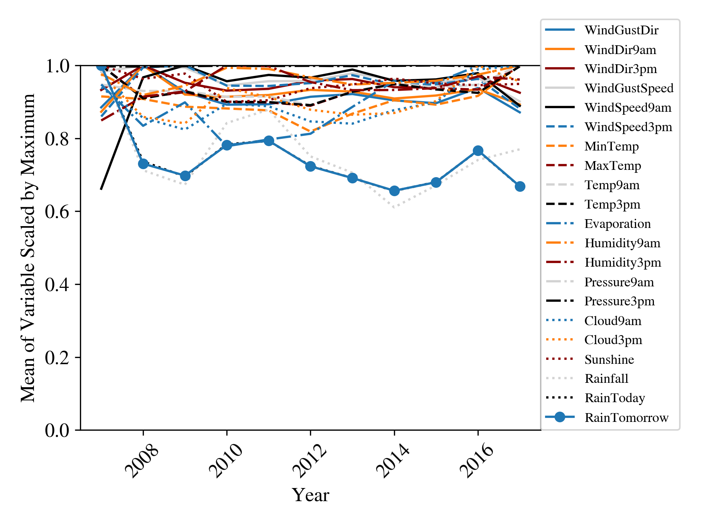

The average of most variables is rather constant over the observed years. Only Evaporation, RainTomorrow/Today and Rainfall vary by more than 20%.

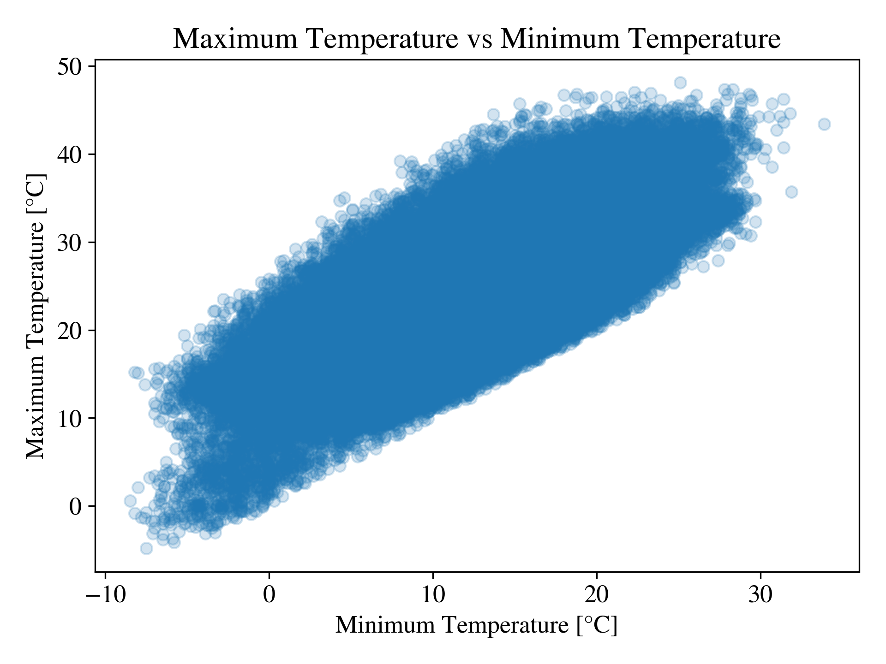

As we found a particularly strong correlation between minimum and maximum temperature in the heatmap plot, we do a scatter plot of these variables and find a linear dependence of both variables. The spreading to a wide point cloud might be due to the different locations included in the plot.

There is a linear correlation between the Evaporation, and the amount of humidity in the atmosphere. We can see that the Evaporation decreases as the
Humidity increases.

The plot of the number of days of rain for each location. The three locations Katherine, Nhil, and Uluru are dismissed, due to the lack of data.
Some locations are more prone to rain than others. It can be an indication of the land for certain part of Australia, as the locations with very little rain can indicate desert areas which are mainly located in the center of Australia.

# Modeling and solving the problem using Machine Learning techniques
## Classification of the problem
The weather forecast project is typically a time series forecasting problem. Machine learning can be used for time series forecasting in the weather forecast project. Specifically, machine learning algorithms such as decision trees, random forests, gradient boosting, and neural networks can be trained on the historical weather data to learn the patterns and relationships between the weather variables and the target variable (such as temperature). The trained model can then be used to make predictions for future time periods based on the current weather data.

Machine learning methods for time series forecasting typically require careful feature engineering, which involves selecting and transforming the relevant weather variables to improve the model's accuracy. In addition, the evaluation of machine learning models for time series forecasting may involve metrics such as mean absolute error (MAE), root mean squared error (RMSE), or coefficient of determination (R-squared) to compare the predicted values with the actual values.

The task of the weather forecast project is to predict weather conditions in Australia, specifically to predict whether it will rain tomorrow based on historical weather observations. This is a predictive modeling task that falls under the category of time series forecasting.
Model selection: Choose a suitable machine learning model or algorithm for the task, such as decision trees, random forests, gradient boosting, or neural networks. Consider the advantages and limitations of each model, and select the one that best fits the data and the problem.

1. Model training: Train the selected model on the prepared dataset using an appropriate training strategy, such as cross-validation or time series split. Optimize the model hyperparameters to maximize the performance metric of interest.

2. Model evaluation: Evaluate the performance of the trained model on the test dataset using appropriate metrics, such as accuracy, precision, recall, F1 score, or mean absolute error (MAE). Compare the performance of different models and choose the best one.

3. Model deployment: Deploy the selected model in a production environment, such as a web application or a mobile app, to provide real-time weather forecasts. Continuously monitor the performance of the model and update it as needed.

These steps may be iterative and require multiple rounds of experimentation and refinement to achieve the desired level of accuracy and reliability.

## Model choice and optimization
Linear regression can be used for weather forecasting, but it may not be the best model for this task as it assumes a linear relationship between the predictor variables and the target variable. In weather forecasting, there can be many complex factors affecting the weather, and a linear model may not be able to capture these complex relationships.

In the example code provided, a random forest regression model is used instead of a linear regression model. Random forest regression is a more flexible model that can handle non-linear relationships between the predictor variables and the target variable, and it can capture complex interactions between the variables.

That being said, there are also other machine learning models that can be used for weather forecasting, such as neural networks, support vector machines, and time-series models like ARIMA and LSTM. The choice of model depends on the specific problem and data at hand, and it's important to evaluate different models and select the one that performs the best for the given task.

Naive Bayes is a probabilistic algorithm that uses Bayes' theorem to calculate the probability of each class given a set of features. It assumes that the features are conditionally independent of each other given the class. Naive Bayes works well with high-dimensional data and is relatively computationally efficient. However, it makes the naive assumption of feature independence and may not perform well when this assumption is violated.

Random Forest Classifier is an ensemble learning method that constructs multiple decision trees and combines their outputs to make predictions. It works well with complex, non-linear relationships between the features and the target variable. Random Forests are generally more accurate than Naive Bayes and are less susceptible to overfitting, but can be slower to train and may not perform well with highly imbalanced data.

Both Naive Bayes and Random Forest Classifier have their strengths and weaknesses, and the choice between them will depend on the specific characteristics of the data and the goals of the prediction task. In the given weather prediction task, Random Forest Classifier achieved higher accuracy and is therefore a good choice.

We omitted trying the SARIMA model because:
- we have several variables, but SARIMA can only use one such that we would loose information available for modeling
- SARIMA would have to be done for each location separately (again information loss)
- weather might not be a "stationary time series" (e.g. extreme weather events, impact of climate changes, bush fires (humans)), such that SARIMA would not be applicable

Instead we use time for trying other models first, that can make use of the whole information / all variables available to us.

## Results 

### Logistic Regression
Logistic Regression is a linear statistical model well suited for binary classification. It is a simple model, but it is still able to give good results. To optimize the model, and get the best possible results I decided to use a grid search. GridSearchCV performs an exhaustive search over a specified set of parameters chosen prior,  on an estimator which in this case is the Logistic Regression model.

The best parameters return by the grid were {'C': 1, 'solver': 'liblinear'}.

Confusion_matrix:
[[16579 4519]
[1493 4644]]

|   real/pred |   0.0 |   1.0 |
|------------:|------:|------:|
|           0 |  0.61 |  0.17 |
|           1 |  0.05 |  0.17 |

|           |      0.0 |     1.0 |   accuracy |   macro avg |   weighted avg |
|:----------|---------:|--------:|-----------:|------------:|---------------:|
| precision |     0.92 |    0.51 |       0.78 |        0.71 |           0.82 |
| recall    |     0.79 |    0.76 |       0.78 |        0.77 |           0.78 |
| f1-score  |     0.85 |    0.61 |       0.78 |        0.73 |           0.79 |
| support   | 21098    | 6137    |       0.78 |    27235    |       27235    |

The accuracy of 0.78 means that out of all the predictions made, 78 % were correctly predicted my the model, which is not very high in order to consider this model efficient.

For our case the recall is an interesting metric to use as the recall which mesures the proportion of true positives out of all the actual positive instances. The recall here is quite close for both classifications (0.79 and 0.76 respectively), which is a good indication that the models predictions are good for both classes, however the recall score is still too low.

The precision which is a measures of the proportion of true positives out of all the instances predicted as positive, and f1 which is the harmonic mean of preicision and recall both have a score of 0.51 and 0.61 for the classification 1 respectively, which is extremely low, but have a score of 0.92 and 0.85 for the classification 0 respectively which can is due to the imbalance in our dataset. The logistic regression not being able to overcome this imbalance does not make it a suitable model to use in order to get the best predictions.

### Support Vector Machine (SVM)
SVM is a linear statistical model well suited for binary classification. In order, to get the best possible results I decided to use a grid search. However, the model takes too much time to process the informations, and give any results. Using the SVM with default parameters, and putting the hyperparameter gamma='scale', the model runs faster.

The "Confusion matrix:
[[16787 	4311]
[1260 	4877]]
                       

|   real/pred |   0.0 |   1.0 |
|------------:|------:|------:|
|           0 |  0.62 |  0.16 |
|           1 |  0.05 |  0.18 |

|           |      0.0 |     1.0 |   accuracy |   macro avg |   weighted avg |
|:----------|---------:|--------:|-----------:|------------:|---------------:|
| precision |     0.93 |    0.53 |        0.8 |        0.73 |           0.84 |
| recall    |     0.8  |    0.79 |        0.8 |        0.8  |           0.8  |
| f1-score  |     0.86 |    0.64 |        0.8 |        0.75 |           0.81 |
| support   | 21098    | 6137    |        0.8 |    27235    |       27235    |

The accuracy of 0.80 means that out of all the predictions made 80% were correct. The svm model have decent results, but still not enough to consider this model viable to be used in weather predictions. The recall score for the two categoris is high, and quite close, but this can't be said for the precision and the f1-score. The results yield are still better than for the logistic regression. However, the computation time of the svm model is quite slow. The training time is very slow, but once the model is trained, the computation time is not still not as fast compared to other models. From the computation time, and the scores obtained, we can't consider svm to be a suitable model to be used in our weather predictions.

### RandomForestClassifier

The table shows different evaluation metrics for the model, including precision, recall, F1-score, and support. These metrics are calculated for each class (0 and 1) as well as for the overall accuracy, macro average, and weighted average.

Precision measures the proportion of true positives out of all the instances predicted as positive. Recall measures the proportion of true positives out of all the actual positive instances. F1-score is the harmonic mean of precision and recall.

The support column shows the number of instances in each class, while the macro average is the average of the metrics calculated for each class, and the weighted average is the average weighted by the number of instances in each class.

In this specific case, the model has an overall accuracy of 97.37%. For class 0, precision is 1, meaning that all instances predicted as 0 are true negatives. Recall is 0.966, indicating that the model is able to correctly identify 96.6% of the actual negatives. For class 1, precision is 0.89, meaning that out of all the instances predicted as positive, 89.4% are true positives. Recall is 1, indicating that the model is able to correctly identify all the actual positives. F1-score is the harmonic mean of precision and recall, and it is 0.944 for class 1, which is a good score. The support column shows that there are 30886 instances of class 0 and 8822 instances of class 1.

**Overview tables for BalancedRandomForestClassifier(default settings) from imblearn on preprocessed data: NaNs replaced by mean or mode over whole column, standard-scaler, no sampling**

Accuracy: 0.8526528364237195
Confusion matrix: [[20104   994]
 [ 3019  3118]]
|   real/pred |    0 |    1 |
|------------:|-----:|-----:|
|           0 | 0.74 | 0.04 |
|           1 | 0.11 | 0.11 |

|           |        0 |       1 |   accuracy |   macro avg |   weighted avg |
|:----------|---------:|--------:|-----------:|------------:|---------------:|
| precision |     0.87 |    0.76 |       0.85 |        0.81 |           0.84 |
| recall    |     0.95 |    0.51 |       0.85 |        0.73 |           0.85 |
| f1-score  |     0.91 |    0.61 |       0.85 |        0.76 |           0.84 |
| support   | 21098    | 6137    |       0.85 |    27235    |       27235    |

### Bagging for RandomForestClassifier
CoBagging (Committee Bagging) is an ensemble machine learning technique that can improve the accuracy and robustness of a single model by combining the predictions of multiple models. The idea behind CoBagging is to partition the training data into subsets, train multiple models on each subset, and then combine the predictions of those models to obtain a final prediction.

The main reason to use CoBagging is to reduce the variance of the prediction by reducing the dependence on any single model. By training multiple models on different subsets of the training data, CoBagging is able to learn multiple diverse representations of the data, which can be combined to produce more accurate and robust predictions. Additionally, CoBagging can help to reduce overfitting by preventing any single model from learning the noise in the data.

CoBagging can be particularly effective when the individual models in the ensemble are prone to making different types of errors or when there is significant variability in the data. In such cases, CoBagging can help to smooth out the errors and improve the overall performance of the model.

In this code,  first I create a base random forest classifier model with 100 estimators, just like in your original code. Then, we create a bagging classifier model by specifying the base model, the number of estimators (10 in this case), and the random state. I train the bagging classifier model on the training data and evaluate its performance on the testing data, just like before. Note that we also print the feature importances of the base model instead of the bagging classifier model, as the bagging classifier model doesn't have its own feature importances.
**Overview tables for BalancedRandomForestClassifier(default settings) from imblearn on preprocessed data: NaNs replaced by mean or mode over whole column, standard-scaler, no sampling**

Accuracy: 0.852138791995594
Confusion matrix: [[20151   947]
 [ 3080  3057]]
|   real |     0 |    1 |
|-------:|------:|-----:|
|      0 | 20151 |  947 |
|      1 |  3080 | 3057 |
|   real/pred |    0 |    1 |
|------------:|-----:|-----:|
|           0 | 0.74 | 0.03 |
|           1 | 0.11 | 0.11 |

|           |        0 |       1 |   accuracy |   macro avg |   weighted avg |
|:----------|---------:|--------:|-----------:|------------:|---------------:|
| precision |     0.87 |    0.76 |       0.85 |        0.82 |           0.84 |
| recall    |     0.96 |    0.5  |       0.85 |        0.73 |           0.85 |
| f1-score  |     0.91 |    0.6  |       0.85 |        0.76 |           0.84 |
| support   | 21098    | 6137    |       0.85 |    27235    |       27235    |

The model achieved an overall accuracy of 0.852, which means that 85.2% of the predictions made by the model were correct.

The confusion matrix shows the number of true positive (TP), false positive (FP), true negative (TN), and false negative (FN) predictions. In this case, the model made 20151 true positive predictions for class 0, 3057 true positive predictions for class 1, 947 false positive predictions for class 1, and 3080 false negative predictions for class 0.

The table below the confusion matrix shows precision, recall, and F1-score for each class, as well as their macro-averaged and weighted-averaged values. Precision is the ratio of true positives to the total predicted positives, recall is the ratio of true positives to the total actual positives, and F1-score is the harmonic mean of precision and recall. The macro-averaged values are the unweighted average of precision, recall, and F1-score for both classes, while the weighted-averaged values take into account the proportion of each class in the data.

### Gaussian Naive Bayes

Gaussian Naive Bayes is a simple and effective probabilistic classification algorithm that can be used for weather forecasting. This algorithm is particularly useful when dealing with high-dimensional data, where the number of features (weather variables) is large. It assumes that each feature follows a Gaussian (normal) distribution, and uses Bayes' theorem to calculate the probability of a certain weather condition (class) given the observed values of the weather variables (features).

In weather forecasting, we often have a large number of weather variables to consider, such as temperature, humidity, pressure, wind speed, and precipitation. These variables can be used as features in the Gaussian Naive Bayes algorithm, allowing us to make predictions about the weather condition (class) for the next day based on the observed values of these variables.

The Gaussian Naive Bayes algorithm is also computationally efficient and can be trained quickly on large datasets, making it a popular choice for weather forecasting applications.

The confusion matrix shows the number of true positives, true negatives, false positives, and false negatives. From this matrix, you can calculate metrics such as precision, recall, and F1 score to understand the performance of your model. Additionally, you can look at individual examples where your model made incorrect predictions to identify potential issues in your data or model.

Accuracy: 0.794272076372315
Confusion matrix: [[18068  3030]
 [ 2573  3564]]
|   real |     0 |    1 |
|-------:|------:|-----:|
|      0 | 18068 | 3030 |
|      1 |  2573 | 3564 |
|   real/pred |    0 |    1 |
|------------:|-----:|-----:|
|           0 | 0.66 | 0.11 |
|           1 | 0.09 | 0.13 |

|           |        0 |       1 |   accuracy |   macro avg |   weighted avg |
|:----------|---------:|--------:|-----------:|------------:|---------------:|
| precision |     0.88 |    0.54 |       0.79 |        0.71 |           0.8  |
| recall    |     0.86 |    0.58 |       0.79 |        0.72 |           0.79 |
| f1-score  |     0.87 |    0.56 |       0.79 |        0.71 |           0.8  |
| support   | 21098    | 6137    |       0.79 |    27235    |       27235    |

Based on the evaluation metrics, the Gaussian Naive Bayes model achieved an accuracy of 0.79, which indicates that it correctly predicted the outcome for about 79% of the test data. The confusion matrix shows that the model correctly predicted 18068 instances of no rain tomorrow (label 0) and 3564 instances of rain tomorrow (label 1), while it incorrectly predicted 3030 instances of rain when it was not going to rain (false positive) and 2573 instances of no rain when it was going to rain (false negative).

In terms of the weather forecast, this means that the model correctly predicted the weather outcome for about 79% of the test data, but it did make some errors in its predictions. So, based on this model, we can say that it is likely to rain tomorrow if the model predicts a label of 1, but there is still a chance that it may not rain (false positives). Conversely, if the model predicts a label of 0, it is likely that it will not rain, but there is still a chance that it may rain (false negatives). Overall, the model provides some guidance, but it is not 100% accurate in its predictions.

### Deep Learning - Keras 

Keras is a high-level neural networks API, written in Python and capable of running on top of several lower-level deep learning frameworks such as TensorFlow, Theano, and CNTK. Keras was designed to enable fast experimentation with deep neural networks, and it is user-friendly, modular, and extensible.

Keras provides a wide range of layers, such as convolutional, recurrent, and dense layers, as well as a variety of activation functions, loss functions, and optimization algorithms. It allows the user to build complex deep learning models with just a few lines of code.

One of the main advantages of Keras is that it provides a clear and concise way of defining deep learning models. The user can easily add or remove layers, change the number of neurons in each layer, and experiment with different activation functions and optimization algorithms.

Keras also provides a variety of tools for training and evaluating deep learning models, such as the fit() method for training the model on a training dataset, and the evaluate() method for evaluating the model on a validation dataset. It also provides several callback functions that can be used to monitor the training process, such as EarlyStopping and ModelCheckpoint.

In summary, Keras is a powerful and easy-to-use tool for building and training deep learning models. It provides a wide range of layers, activation functions, loss functions, and optimization algorithms, and it allows the user to easily build and experiment with complex models.

In this code, we first import the necessary modules including the Sequential model and the Dense and Dropout layers from Keras. We then define the model architecture by adding layers to the model. The first layer has 64 neurons and uses the relu activation function, while the second layer has 32 neurons and also uses relu. We add a Dropout layer after each of these two layers to reduce overfitting. The final layer has only one neuron with a sigmoid activation function, which is appropriate for binary classification problems.

This is a neural network model trained for weather forecasting, where the goal is to predict whether or not it will rain tomorrow. The data has already been preprocessed into missing values (NaN) and coded as numerical features.

**Overview tables for BalancedRandomForestClassifier(default settings) from imblearn on preprocessed data: NaNs replaced by mean or mode over whole column, standard-scaler, no sampling**
Accuracy: 0.8526528364237195
Confusion matrix: [[20104   994]
 [ 3019  3118]]
|   real |     0 |    1 |
|-------:|------:|-----:|
|      0 | 20104 |  994 |
|      1 |  3019 | 3118 |
|   real/pred |    0 |    1 |
|------------:|-----:|-----:|
|           0 | 0.74 | 0.04 |
|           1 | 0.11 | 0.11 |

|           |        0 |       1 |   accuracy |   macro avg |   weighted avg |
|:----------|---------:|--------:|-----------:|------------:|---------------:|
| precision |     0.87 |    0.76 |       0.85 |        0.81 |           0.84 |
| recall    |     0.95 |    0.51 |       0.85 |        0.73 |           0.85 |
| f1-score  |     0.91 |    0.61 |       0.85 |        0.76 |           0.84 |
| support   | 21098    | 6137    |       0.85 |    27235    |       27235    |

The model has 30 input features and is trained using 100 epochs with a batch size of 32. The optimizer used is not listed, but the loss function is cross-entropy, and the metric used for evaluation is accuracy.

During training, loss and accuracy on both the training and validation sets are displayed for each epoch. Training accuracy starts at 83.03% and gradually increases to 86.26% at the end of the 20th epoch. Validation accuracy also increases gradually to 85.82% at the end of the 19th epoch, after which it begins to fluctuate slightly. The loss function decreases similarly for both the training and validation sets.

It is worth noting that the model may have been over-fitted to the training data, as the validation accuracy did not improve after the 19th epoch, while the training accuracy continued to increase. To mitigate over-fitting, regularization techniques such as dropout or L1/L2 regularization can be applied, or the model architecture can be simplified. In addition, the model's performance can be evaluated on a test set (hold-out) to get an unbiased estimate of its performance on new, unseen data. 

### Best Model - Random Forest Classifier

The random forest model seems to be a good first approach, as it features internal bagging (of decision trees with random initial parameters), is robust against overfitting and yields feature importances for a good interpretability. Since it separates the data into classes by splitting according to a threshold on the values of features, it is especially useful to, for instance, differentiate the different locations and classifiy the weather in high or low humidity branches, where humidity will likely be an important feature, as it rises when rain is to be expected.

Since some features contain a lot of NaN values (10% to about 50% of all entries), and these variables are expected to have a big influence on the model decision (for meteorological reasons), the difference between replacing the NaN values with the mean or mode over the whole column and dropping all rows with NaN values is analyzed. The fraction of NaN values per *Location* for the features with most NaN values (*Sunshine, Cloud9am, Could3pm, Evaporation, Pressure9am, Pressure3pm*) is plotted in the figure below.

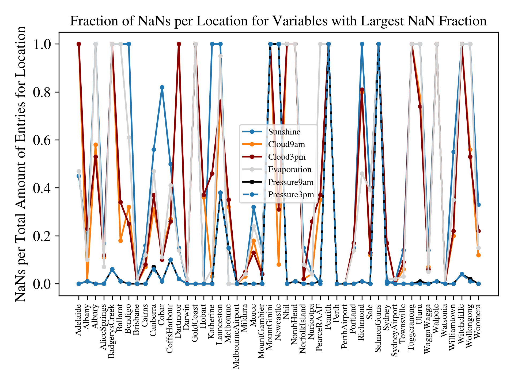
 
It is apparent that some locations do not provide information on these features at all (NaN fraction equal to 1). Therefore, dropping all rows with NaN values seems to be a reasonable first try, which could be improved in the future, by replacing NaNs with data from nearby stations.

The first try with the *RandomForestClassifier* of *sklearn* is performed on data that is preprocessed as discussed in [report 1](./report1.md). Mentioning some relevant preprocessing steps, entries with NaN values in the target variable *RainTomorrow* and related variables *RainToday*, *Rainfall* are dropped, whereas NaN values of features are replaced by the mean (continuous variables) or mode (discrete variables). A standard scaler fitted only to the train data is used for scaling all features. Here, no action is performed to counteract imbalance in the target classes (less rainy days than non-rainy days).

The results of the RandomForestClassifier are presented in the table below. Here and in the following, all scores are given for the test set.

**Overview tables for RandomForestClassifier(default settings) from sklearn on preprocessed data: NaNs replaced by mean or mode over whole column, standard-scaler, no sampling**

|   real/pred |    0 |    1 |
|------------:|-----:|-----:|
|           0 | 0.74 | 0.04 |
|           1 | 0.11 | 0.11 |

|           |        0 |       1 |   accuracy |   macro avg |   weighted avg |
|:----------|---------:|--------:|-----------:|------------:|---------------:|
| precision |     0.87 |    0.76 |       0.85 |        0.81 |           0.84 |
| recall    |     0.95 |    0.51 |       0.85 |        0.73 |           0.85 |
| f1-score  |     0.91 |    0.61 |       0.85 |        0.76 |           0.84 |
| support   | 21098    | 6137    |       0.85 |    27235    |       27235    |

|               |   feature_importance |
|:--------------|---------------------:|
| Temp3pm       |                 0.04 |
| Humidity9am   |                 0.04 |
| Pressure9am   |                 0.04 |
| WindGustSpeed |                 0.05 |
| Rainfall      |                 0.05 |
| Pressure3pm   |                 0.05 |
| Sunshine      |                 0.06 |
| Humidity3pm   |                 0.16 |

Although the accuracy of 0.85 is a good result and due to the imbalance in the target classes, the F1-, and recall score are very imbalanced and worse for the target class defining rainy days (1). This is also visible in the first table showing the confusion matrix. The eight most important features of the model are shown in the last table to interprete the model. From a meteorological standpoint, the feature importances seem to be reasonable: in high humidity and for low sunshine hours and pressures on a day, the probability of having a rainy day on the next day is increased, such that the model bases its decision on thresholds set on these variables.

Trying to counteract the influence of the imbalanced dataset by using the "class_weight" parameter of the RandomForestClassifier of sklearn does not improve the scores, but rather decreased them slightly.

Therefore, the *BalancedRandomForestClassifier* from *imblearn* is tested, but apart from switching the contribution from False Positives to False Negatives (if no over- or undersampling was used), the scores do not change significantly as visible in the summary tables below. Only the values of precision of recall are exchanged. Feature importances are also similar.

**Overview tables for BalancedRandomForestClassifier(default settings) from imblearn on preprocessed data: NaNs replaced by mean or mode over whole column, standard-scaler, no sampling**

|   real/pred |    0 |    1 |
|------------:|-----:|-----:|
|           0 | 0.62 | 0.15 |
|           1 | 0.05 | 0.18 |

|           |        0 |       1 |   accuracy |   macro avg |   weighted avg |
|:----------|---------:|--------:|-----------:|------------:|---------------:|
| precision |     0.93 |    0.54 |        0.8 |        0.73 |           0.84 |
| recall    |     0.8  |    0.79 |        0.8 |        0.8  |           0.8  |
| f1-score  |     0.86 |    0.64 |        0.8 |        0.75 |           0.81 |
| support   | 21098    | 6137    |        0.8 |    27235    |       27235    |

|               |   feature_importance |
|:--------------|---------------------:|
| Temp3pm       |                 0.04 |
| Humidity9am   |                 0.05 |
| Pressure9am   |                 0.05 |
| WindGustSpeed |                 0.05 |
| Pressure3pm   |                 0.05 |
| Rainfall      |                 0.05 |
| Sunshine      |                 0.07 |
| Humidity3pm   |                 0.15 |

The best accuracy of 0.86 is obtained when using random oversampling and dropping all rows with NaN values in preprocessing. The F1 score for default preprocessing is 0.91 for target class 0 and 0.61 for target class 1 (macro_avg 0.76, weighted_avg 0.84). Oversampling improves the F1 score slightly and similar to the accuracy, also the F1 score is best when using random oversampling and dropping all rows with NaN values in preprocessing (macro_avg 0.77, weighted_avg 0.85). The summary tables for the best preprocessing and the default RandomForestClassifier of sklearn are shown below.

**Overview tables for RandomForestClassifier(default settings) from sklearn on preprocessed data: all rows with NaN dropped, standard scaling, over sampling**

|   real/pred |    0 |    1 |
|------------:|-----:|-----:|
|           0 | 0.74 | 0.05 |
|           1 | 0.1  | 0.12 |

|           |       0 |       1 |   accuracy |   macro avg |   weighted avg |
|:----------|--------:|--------:|-----------:|------------:|---------------:|
| precision |    0.88 |    0.73 |       0.86 |        0.81 |           0.85 |
| recall    |    0.94 |    0.55 |       0.86 |        0.75 |           0.86 |
| f1-score  |    0.91 |    0.63 |       0.86 |        0.77 |           0.85 |
| support   | 8810    | 2474    |       0.86 |    11284    |       11284    |

|               |   feature_importance |
|:--------------|---------------------:|
| Rainfall      |                 0.04 |
| Humidity9am   |                 0.04 |
| WindGustSpeed |                 0.05 |
| Pressure9am   |                 0.05 |
| Pressure3pm   |                 0.05 |
| Cloud3pm      |                 0.06 |
| Humidity3pm   |                 0.14 |
| Sunshine      |                 0.14 |

Comparing the feature importances with the previous results (where NaNs were replaced by mean or mode) it is apparent that dropping all rows with NaN changes the importance of features in the RandomForestClassifier. This is likely due to the significantly changed amount of entries for some features (like *Sunshine*) and the bias induced by replacing NaNs by the mean or mode over the whole column. This way of treating NaNs does not take the different weather characteristics in different weather stations into account, such that the importance of a feature might be degraded. This was likely the case for the *Sunshine* feature, whose importance doubles when dropping all NaN values. In all models *Sunshine* and *Humidity3pm* are the most important features. Also the 3pm variables are always more important than the 9am variables, which indicates, that adding features from e.g. 2 or 3 days before the day to be predicted will not yield any gain in the model performance, because the weather on the next day most strongly depends on the weather parameters on the afternoon of the day before. Therefore, the focus on feature engineering will be on including data from nearby stations rather than data from previous days.

### Random Forest using only most important features as input

Additionally, a test was carried out to check, how good the model performs when it only gets the two most important features *Sunshine* and *Humidity3pm* as inputs.

To investiagte why Humidity and Sunshine are so important, a scatter plot of both is shown below, where the value of the target variable *RainTomorrow* is encoded in the color. It is clearly visible that for higher humidities in the afternoon and lower sunshine hours of a specific day, the probability of facing rain on the following day is larger (dominant yellow markers on the bottom right of the plot).

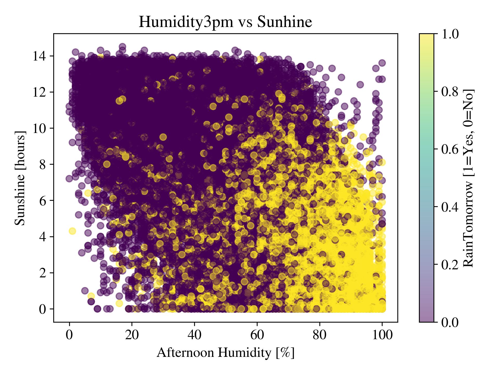

#### Random Forest on *Sunshine* and *Humidity3pm*

|   real/pred |    0 |    1 |
|------------:|-----:|-----:|
|           0 | 0.58 | 0.2  |
|           1 | 0.08 | 0.14 |

|           |       0 |       1 |   accuracy |   macro avg |   weighted avg |
|:----------|--------:|--------:|-----------:|------------:|---------------:|
| precision |    0.88 |    0.41 |       0.72 |        0.65 |           0.78 |
| recall    |    0.74 |    0.64 |       0.72 |        0.69 |           0.72 |
| f1-score  |    0.81 |    0.5  |       0.72 |        0.65 |           0.74 |
| support   | 8810    | 2474    |       0.72 |    11284    |       11284    |

|             |   feature_importance |
|:------------|---------------------:|
| Humidity3pm |                 0.46 |
| Sunshine    |                 0.54 |

#### Random Forest with all features (and same preprocessing)

|   real/pred |    0 |    1 |
|------------:|-----:|-----:|
|           0 | 0.74 | 0.05 |
|           1 | 0.1  | 0.12 |

|           |       0 |       1 |   accuracy |   macro avg |   weighted avg |
|:----------|--------:|--------:|-----------:|------------:|---------------:|
| precision |    0.88 |    0.73 |       0.86 |        0.8  |           0.85 |
| recall    |    0.94 |    0.55 |       0.86 |        0.74 |           0.86 |
| f1-score  |    0.91 |    0.62 |       0.86 |        0.77 |           0.85 |
| support   | 8810    | 2474    |       0.86 |    11284    |       11284    |

|               |   feature_importance |
|:--------------|---------------------:|
| Rainfall      |                 0.04 |
| Humidity9am   |                 0.04 |
| Pressure9am   |                 0.05 |
| WindGustSpeed |                 0.05 |
| Pressure3pm   |                 0.05 |
| Cloud3pm      |                 0.06 |
| Humidity3pm   |                 0.13 |
| Sunshine      |                 0.14 |

As can be seen from the summary tables above, the random forest performs worse, when only getting the two most important features as input. However, the model is still performing better than a completely random model. It is concluded, that although *Sunshine* and *Humidity3pm* are by far the most important features for the random forest classifier, the other features are required in addition to obtain the good performance (accuracy rises from 0.72 to 0.86 and F1 also increases by 0.1 to 0.77 for the marco-averaged score).

### Conclusions from all models

We can conclude, that out of logistic regression optimized by hyperparameter optimization, SVM (not optimized due to long computation time), (balanced) random forest, Gaussian Naive Bayes, and a Dense Neural Network designed in Keras, the random forest yields the best performance at low computation cost. The random forest yields an accuracy of 0.86 and marco- and weighted-averaged F1-scores of 0.77 and 0.85, respectively, which is slightly larger than for the other models. However, all models performed very similarly without significant differences in these scores. The simplest models namely logistic regression, SVM, and Gaussian Naive Bayes yielded the least performance, all featuring accuracies and marco- and weighted-averaged F1-scores of about 0.8, 0.7, and 0.8, respectively.

Crossvalidation for hyperparameter optimization of the RandomForestClassifier might improve the performance. However the features that are most important for the model, contain the most NaN values. So a better treatment of these NaN values is decided to be the best and most important step to improve the model performance. One idea is to add the average value of each variable over all stations nearby the respective station.

### Proposal for further feature engineering - including data from nearby stations
First steps to include data from nearby stations were undertaken using the geopy library in  python and the webscrapped locations of the weather stations (longitude and latitude data). The plot below shows the locations of all weather stations, which are in the dataset.

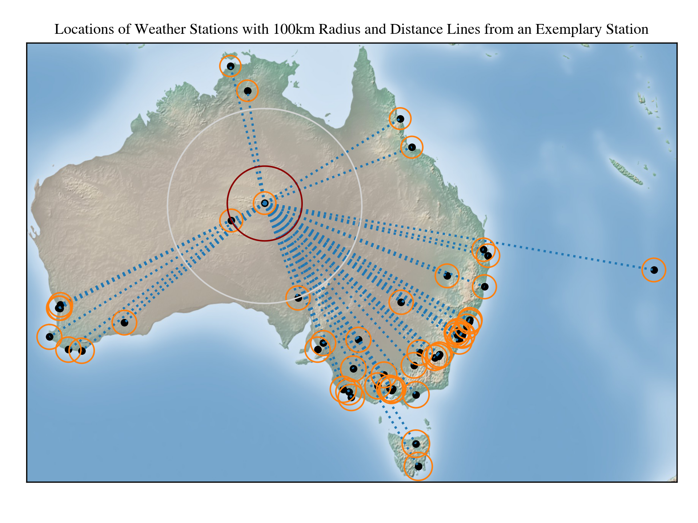

The orange circles are [tissot's indicatrices](https://en.wikipedia.org/wiki/Tissot%27s_indicatrix) and indicate the area around each weather station with a radius of 100km. Distance lines are shown for an exemplary station in the center of Australia, for which also two further. For the densely populated regions at the South-East- and South-West coast of Australia, several weather stations are located within a distance smaller than 100km.For other stations not a single one is located within this distance. However, usually at least one station is located in the same region of Australia (e.g. two stations in the center of Australia and two in North and North-East).
Therefore, the approach is to include all station within an area covered by a radius of 100km or at least the nearest neighbour. One could also use a clustering model here, but this is omitted for now.

The plan is to calculate the mean value of each feature for these nearby stations and add these new features to the preprocessing pipeline (as additional features). Also, in case there are NaN values for a feature of a station, the mean value for the nearby stations can be used to replace the missing value.

Finally, the user of our project might simply give a Location (string type) and a date (datetime type) as input and get the weather prediction for the nearest weather station as output.

Additional refinements might include:
- using a weighted average based on the distance from the central station
- giving the user a prediction based on a weighted average from all stations nearby
- weighting the data of each nearby station by the wind direction
 
# Further modeling after rethinking the preprocessing

As discussed at the end of the previous section on modeling, additional preprocessing steps are implemented to test, whether a better performance can be achieved.
Several new stragtegies were implemented, which are listed here:

#### **1. Removing irrelevant data (space):**

Remove all locations, where at least one feature contains exclusively NaN values. These features are almost exclusively the most important features for the RainTomorrow prediction (e.g. Sunshine, Humidity). This justifies to remove these locations, as including a station without any values for such important feature will most likely not improve the model. This leads to the reduction in the amount of locations from 49 to 26 as shown in the plot below.

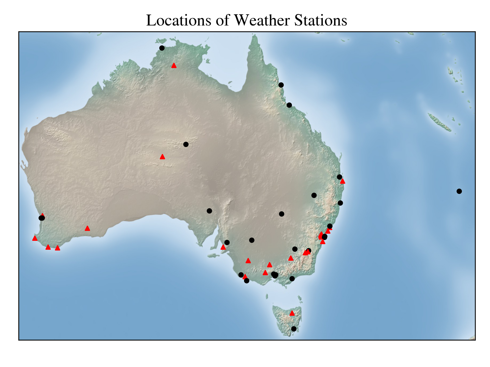

In the plot red triangles mark locations that have to be dropped, due to the NaN features, whereas the circular black markes show the remaining 36 positions of weather stations. Note that 5 out of the remaining 26 stations have less than 50% entries without NaN values in all features, (some only 11%), 11 out of 26 locations have less then 70% entries without NaN in any of the features. This is still a siginificant fraction of NaN values, which has to be handled with care. Taking the average over nearby stations will be the chosen approach here. The table below shows the NaN fractions [%] of most important features (for the random forest with best performance) per location:

| Location         |   Sunshine |   Humidity3pm |   Cloud3pm |   Pressure3pm |   WindGustSpeed |   Pressure9am |
|:-----------------|-----------:|--------------:|-----------:|--------------:|----------------:|--------------:|
| AliceSprings     |       16.9 |           0.1 |       11.8 |           0.1 |             1.6 |           0   |
| Brisbane         |        1.6 |           0.3 |        0.1 |           0   |             0.4 |           0   |
| Cairns           |       13.7 |           0   |        6.7 |           0   |             0.5 |           0   |
| Canberra         |       63.7 |           0.4 |       41.8 |           7.4 |            10.7 |           7.5 |
| Cobar            |       81.5 |           3.8 |        9.9 |           0.8 |             1.2 |           0.9 |
| CoffsHarbour     |       49.4 |           0.4 |       24.6 |           8.9 |            10.5 |           8.8 |
| Darwin           |        0.1 |           0.1 |        0.1 |           0.1 |             1.2 |           0   |
| Hobart           |        0.3 |           0.4 |       38.8 |           0   |             0.4 |           0   |
| Melbourne        |        0   |           0.3 |       15.8 |           0.1 |             0.7 |           0   |
| MelbourneAirport |        0   |           0.3 |        0   |           0   |             0.5 |           0   |
| Mildura          |        4.4 |           0.1 |        4.9 |           0.1 |             0.1 |           0.1 |
| Moree            |       26.5 |           0.1 |       12.2 |           0   |             2.5 |           0   |
| MountGambier     |       14.2 |           0.3 |        3.5 |           0.2 |             1.4 |           0   |
| NorfolkIsland    |       12.8 |           0.1 |        1.9 |           0.1 |             1.4 |           0.2 |
| Nuriootpa        |        5.1 |           0.4 |       25.4 |           0.3 |             1   |           0.2 |
| Perth            |        0.2 |           0.1 |        0.1 |           0   |             0.2 |           0   |
| PerthAirport     |        0.2 |           0   |        0.1 |           0   |             1.5 |           0.1 |
| Portland         |       14.7 |           0.4 |       17.3 |           0.3 |             0.8 |           0.4 |
| Sale             |       39.2 |           0.5 |       12.8 |           0.5 |             4.4 |           0.5 |
| Sydney           |        0.5 |           0.4 |       18.6 |           0.6 |            23.3 |           0.6 |
| SydneyAirport    |        0.5 |           0.1 |        0   |           0.1 |             1.7 |           0.3 |
| Townsville       |       13.8 |           0   |        9.1 |           0   |             0.7 |           0   |
| WaggaWagga       |       12.9 |           0   |        5.1 |           0   |             0.9 |           0   |
| Watsonia         |        0   |           0   |        0   |           0   |             1   |           0   |
| Williamtown      |       43.3 |           0.3 |       18.1 |           0.4 |             4.6 |           0.4 |
| Woomera          |       32.9 |           0.9 |       21.7 |           0.5 |             1.3 |           0.4 |

From the table below, which shows the fraction of entries with at least one feature having a NaN value per Location, it is conluded that the *MelbourneAirport* location has the most complete and consistent data.

| Location         |   Fraction_of_rows_w_NaN |
|:-----------------|-------------------------:|
| MelbourneAirport |                    0.027 |
| PerthAirport     |                    0.032 |
| Darwin           |                    0.035 |
| SydneyAirport    |                    0.044 |
| Perth            |                    0.052 |
| Brisbane         |                    0.059 |
| Watsonia         |                    0.087 |
| Mildura          |                    0.137 |
| NorfolkIsland    |                    0.163 |
| Cairns           |                    0.176 |
| WaggaWagga       |                    0.183 |
| MountGambier     |                    0.186 |
| Melbourne        |                    0.188 |
| Townsville       |                    0.203 |
| AliceSprings     |                    0.268 |
| Moree            |                    0.315 |
| Nuriootpa        |                    0.33  |
| Portland         |                    0.376 |
| Hobart           |                    0.41  |
| Woomera          |                    0.419 |
| Sydney           |                    0.436 |
| Sale             |                    0.439 |
| Williamtown      |                    0.496 |
| CoffsHarbour     |                    0.531 |
| Canberra         |                    0.767 |
| Cobar            |                    0.821 |

#### **2. Removing irrelevant data part (time):**

To remove all data from before 01.01.2009, because only from 01.01.2009 data from all locations is available, before only about 50% of locations have data as summarized in the table below, which lists the minimum and maximum dates with data for each location.

| Location         | ('Date', 'min')   | ('Date', 'max')   |
|:-----------------|:------------------|:------------------|
| Canberra         | 2007-11-01        | 2017-06-25        |
| Sydney           | 2008-02-01        | 2017-06-25        |
| Brisbane         | 2008-07-01        | 2017-06-25        |
| Darwin           | 2008-07-01        | 2017-06-24        |
| Hobart           | 2008-07-01        | 2017-06-25        |
| Melbourne        | 2008-07-01        | 2017-06-25        |
| Perth            | 2008-07-01        | 2017-06-25        |
| AliceSprings     | 2008-12-01        | 2017-06-24        |
| Cairns           | 2008-12-01        | 2017-06-25        |
| MountGambier     | 2008-12-01        | 2017-06-24        |
| Townsville       | 2008-12-01        | 2017-06-25        |
| Cobar            | 2009-01-01        | 2017-06-25        |
| CoffsHarbour     | 2009-01-01        | 2017-06-25        |
| MelbourneAirport | 2009-01-01        | 2017-06-25        |
| Mildura          | 2009-01-01        | 2017-06-25        |
| Moree            | 2009-01-01        | 2017-06-25        |
| NorfolkIsland    | 2009-01-01        | 2017-06-25        |
| Nuriootpa        | 2009-01-01        | 2017-06-24        |
| PerthAirport     | 2009-01-01        | 2017-06-25        |
| Portland         | 2009-01-01        | 2017-06-25        |
| Sale             | 2009-01-01        | 2017-06-25        |
| SydneyAirport    | 2009-01-01        | 2017-06-25        |
| WaggaWagga       | 2009-01-01        | 2017-06-25        |
| Watsonia         | 2009-01-01        | 2017-06-25        |
| Williamtown      | 2009-01-01        | 2017-06-25        |
| Woomera          | 2009-01-01        | 2017-06-24        |

#### **3. Handling imbalance:**

Concluding from the results of the previous modelling section, oversampling will be used to counteract the imbalanced data.

#### **4. Feature engineering:**

To provide more important information to the models, namely information on the weather conditions in the surrounding of each station, a weighted-average over nearby locations is calculated for each feature and added as additional features (this is done for all features, except for the datetime features, this increasing the amount of features from 29 to 55). In order to define, which station is considered as "nearby" each station, different metrics for closeness/distance were used:

##### **Pearson correlation coefficient:**

Pearson correlation coefficient between stations based on *Rainfall* feature: if the correlation between two stations in the Rainfall feature is large, when calculating the correlation over the whole dataset spanning several years, the weather conditions with respect to our target variable *RainTomorrow* are likely (but not certainly) causally connected. Therefore a threshold on the correlation coefficient is required to generate weigthed averaged features from nearby stations. The weight of each station is defined to be equal to the correlation coefficient, i.e. 1 for the station itself and a value between 1 and 0 for the "nearby" stations. Note that this approach is tested in addition to the distance metric, because spatially nearby stations might not share the same weather conditions. For instance at the coast in the south-east of australia, there is a mountain range, so if stations are close to each other but separated by the mountains, the weather conditions and especially "RainTomorrow" might be very different. This is indeed the case as visible in the strong gradient in the cummulative Rainfall map over many years: [BOM](http://www.bom.gov.au/climate/maps/rainfall/?variable=rainfall&map=totals&period=48month&region=nat&year=2023&month=04&day=30). Below, 3 plots are shown giving the color coded correlation coefficient for 3 different central stations. The threshold on the correlation coefficient is chosen such that are spatially relatively close, the next neighbouring station is still included, this is the case for a threshold of about 0.3 as visible in the plot below for the *Cairns* location (Cairns is located at the dark red dot marked with a correlation coefficient of 1.0).

For some stations that are spatially isolated from the rest of the stations, the correlation coeeficient of the next neighbouring station is below 0.3. Therefore, for such stations the station with largest coefficient is included, which is *Woomera* for the example of *AliceSprings* shown in the plot below.

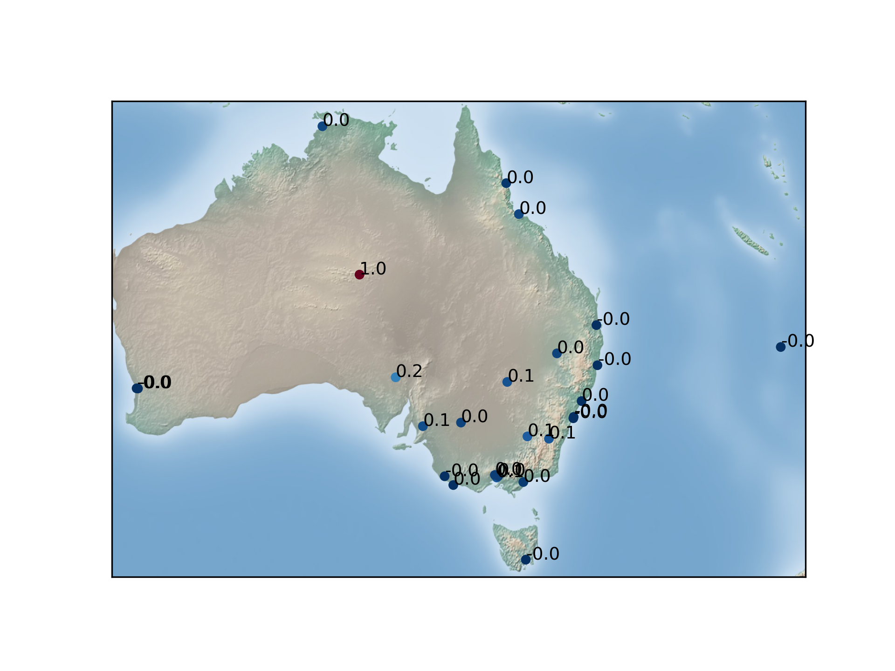

For the station containing the least amount of NaN values, *MelbourneAirport*, several surrounding stations have a correlation coefficient above 0.3, as shown in the plot below (*MelbourneAirport*, *Melbourne*, and *Watsonia* stations are so close together that they overlap on the map).

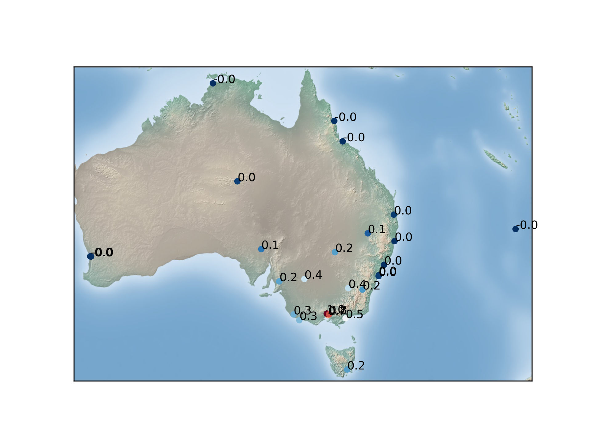

For the correlation threshold of 0.3 we would also include stations far away from the chosen one *MelbourneAirport* as visible in the last plot. Therefore a second preprocessing with a higher threshold of 0.5 is tested as well.

##### **Spatial Distance:**

Spatial distance as metric (based on 2D distance on surface of the Earth). This is the more intuitive metric for finding nearby stations and was discussed already at the end of the previous modeling section and shown in a map with circles of 100km radius around each station. The weights for averaging over neabry stations was chosen to be $w = \frac{1}{\mathrm{distance} + 200}\cdot 200$, in order to give the central station a weight of one and a station in 100km distance a weight of 2/3. Two different thresholds on the maximum distance to include in the calculation of the weighted-average were chosen, 100km and 300km, where the 100km threshold practivally corresponds to taking only the nearest neighbor into consideration.

In two following tables we give an overview on the different weights for each pair of locations.

Weights for feature engineering of weighted average over nearby stations for Pearson correlation with respect to "Rainfall" feature of each location as metric and a threshold on the correlation coefficient of >0.3 (if this yields none, the station with next smaller correlation coefficient is chosen (e.g. for AliceSprings)):

|                  |   AliceSprings |   Brisbane |   Cairns |   Canberra |   Cobar |   CoffsHarbour |   Darwin |   Hobart |   Melbourne |   MelbourneAirport |   Mildura |   Moree |   MountGambier |   NorfolkIsland |   Nuriootpa |   Perth |   PerthAirport |   Portland |   Sale |   Sydney |   SydneyAirport |   Townsville |   WaggaWagga |   Watsonia |   Williamtown |   Woomera |
|:-----------------|---------------:|-----------:|---------:|-----------:|--------:|---------------:|---------:|---------:|------------:|-------------------:|----------:|--------:|---------------:|----------------:|------------:|--------:|---------------:|-----------:|-------:|---------:|----------------:|-------------:|-------------:|-----------:|--------------:|----------:|
| AliceSprings     |              1 |        0   |      0   |        0   |     0   |            0   |        0 |        0 |         0   |                0   |       0   |     0   |            0   |               0 |         0   |     0   |            0   |        0   |    0   |      0   |             0   |          0   |          0   |        0   |           0   |       0.2 |
| Brisbane         |              0 |        1   |      0   |        0   |     0   |            0.3 |        0 |        0 |         0   |                0   |       0   |     0   |            0   |               0 |         0   |     0   |            0   |        0   |    0   |      0   |             0   |          0   |          0   |        0   |           0   |       0   |
| Cairns           |              0 |        0   |      1   |        0   |     0   |            0   |        0 |        0 |         0   |                0   |       0   |     0   |            0   |               0 |         0   |     0   |            0   |        0   |    0   |      0   |             0   |          0.3 |          0   |        0   |           0   |       0   |
| Canberra         |              0 |        0   |      0   |        1   |     0.3 |            0   |        0 |        0 |         0   |                0   |       0   |     0   |            0   |               0 |         0   |     0   |            0   |        0   |    0.4 |      0   |             0.3 |          0   |          0.6 |        0   |           0   |       0   |
| Cobar            |              0 |        0   |      0   |        0.3 |     1   |            0   |        0 |        0 |         0   |                0   |       0   |     0   |            0   |               0 |         0   |     0   |            0   |        0   |    0   |      0   |             0   |          0   |          0.4 |        0   |           0   |       0   |
| CoffsHarbour     |              0 |        0.3 |      0   |        0   |     0   |            1   |        0 |        0 |         0   |                0   |       0   |     0.3 |            0   |               0 |         0   |     0   |            0   |        0   |    0   |      0   |             0   |          0   |          0   |        0   |           0.3 |       0   |
| Darwin           |              0 |        0   |      0   |        0   |     0   |            0   |        1 |        0 |         0   |                0   |       0   |     0   |            0   |               0 |         0   |     0   |            0   |        0   |    0   |      0   |             0   |          0.1 |          0   |        0   |           0   |       0   |
| Hobart           |              0 |        0   |      0   |        0   |     0   |            0   |        0 |        1 |         0   |                0   |       0   |     0   |            0   |               0 |         0   |     0   |            0   |        0   |    0   |      0   |             0   |          0   |          0   |        0.2 |           0   |       0   |
| Melbourne        |              0 |        0   |      0   |        0   |     0   |            0   |        0 |        0 |         1   |                0.7 |       0   |     0   |            0   |               0 |         0   |     0   |            0   |        0.3 |    0.4 |      0   |             0   |          0   |          0.3 |        0.7 |           0   |       0.3 |
| MelbourneAirport |              0 |        0   |      0   |        0   |     0   |            0   |        0 |        0 |         0.7 |                1   |       0.4 |     0   |            0   |               0 |         0.3 |     0   |            0   |        0   |    0.5 |      0   |             0   |          0   |          0.4 |        0.9 |           0   |       0   |
| Mildura          |              0 |        0   |      0   |        0   |     0   |            0   |        0 |        0 |         0   |                0.4 |       1   |     0   |            0   |               0 |         0.4 |     0   |            0   |        0.3 |    0   |      0   |             0   |          0   |          0   |        0.4 |           0   |       0   |
| Moree            |              0 |        0   |      0   |        0   |     0   |            0.3 |        0 |        0 |         0   |                0   |       0   |     1   |            0   |               0 |         0   |     0   |            0   |        0   |    0   |      0   |             0   |          0   |          0   |        0   |           0   |       0   |
| MountGambier     |              0 |        0   |      0   |        0   |     0   |            0   |        0 |        0 |         0   |                0   |       0   |     0   |            1   |               0 |         0.4 |     0   |            0   |        0.8 |    0   |      0   |             0   |          0   |          0   |        0   |           0   |       0   |
| NorfolkIsland    |              0 |        0   |      0   |        0   |     0   |            0   |        0 |        0 |         0   |                0   |       0   |     0   |            0   |               1 |         0   |     0   |            0   |        0   |    0   |      0   |             0   |          0   |          0   |        0   |           0   |       0   |
| Nuriootpa        |              0 |        0   |      0   |        0   |     0   |            0   |        0 |        0 |         0   |                0.3 |       0.4 |     0   |            0.4 |               0 |         1   |     0   |            0   |        0.4 |    0   |      0   |             0   |          0   |          0   |        0   |           0   |       0.3 |
| Perth            |              0 |        0   |      0   |        0   |     0   |            0   |        0 |        0 |         0   |                0   |       0   |     0   |            0   |               0 |         0   |     1   |            0.9 |        0   |    0   |      0   |             0   |          0   |          0   |        0   |           0   |       0   |
| PerthAirport     |              0 |        0   |      0   |        0   |     0   |            0   |        0 |        0 |         0   |                0   |       0   |     0   |            0   |               0 |         0   |     0.9 |            1   |        0   |    0   |      0   |             0   |          0   |          0   |        0   |           0   |       0   |
| Portland         |              0 |        0   |      0   |        0   |     0   |            0   |        0 |        0 |         0.3 |                0   |       0.3 |     0   |            0.8 |               0 |         0.4 |     0   |            0   |        1   |    0   |      0   |             0   |          0   |          0   |        0.3 |           0   |       0   |
| Sale             |              0 |        0   |      0   |        0.4 |     0   |            0   |        0 |        0 |         0.4 |                0.5 |       0   |     0   |            0   |               0 |         0   |     0   |            0   |        0   |    1   |      0   |             0   |          0   |          0.3 |        0.5 |           0   |       0   |
| Sydney           |              0 |        0   |      0   |        0   |     0   |            0   |        0 |        0 |         0   |                0   |       0   |     0   |            0   |               0 |         0   |     0   |            0   |        0   |    0   |      1   |             0.9 |          0   |          0   |        0   |           0.5 |       0   |
| SydneyAirport    |              0 |        0   |      0   |        0.3 |     0   |            0   |        0 |        0 |         0   |                0   |       0   |     0   |            0   |               0 |         0   |     0   |            0   |        0   |    0   |      0.9 |             1   |          0   |          0   |        0   |           0.4 |       0   |
| Townsville       |              0 |        0   |      0.3 |        0   |     0   |            0   |        0 |        0 |         0   |                0   |       0   |     0   |            0   |               0 |         0   |     0   |            0   |        0   |    0   |      0   |             0   |          1   |          0   |        0   |           0   |       0   |
| WaggaWagga       |              0 |        0   |      0   |        0.6 |     0.4 |            0   |        0 |        0 |         0.3 |                0.4 |       0   |     0   |            0   |               0 |         0   |     0   |            0   |        0   |    0.3 |      0   |             0   |          0   |          1   |        0.4 |           0   |       0   |
| Watsonia         |              0 |        0   |      0   |        0   |     0   |            0   |        0 |        0 |         0.7 |                0.9 |       0.4 |     0   |            0   |               0 |         0   |     0   |            0   |        0.3 |    0.5 |      0   |             0   |          0   |          0.4 |        1   |           0   |       0   |
| Williamtown      |              0 |        0   |      0   |        0   |     0   |            0.3 |        0 |        0 |         0   |                0   |       0   |     0   |            0   |               0 |         0   |     0   |            0   |        0   |    0   |      0.5 |             0.4 |          0   |          0   |        0   |           1   |       0   |
| Woomera          |              0 |        0   |      0   |        0   |     0   |            0   |        0 |        0 |         0.3 |                0   |       0   |     0   |            0   |               0 |         0.3 |     0   |            0   |        0   |    0   |      0   |             0   |          0   |          0   |        0   |           0   |       1   |

Weights for feature engineering of weighted average over nearby stations for distance of locations as metric with a threshold of <100km radius (if this yields none, the station with next larger distance is chosen (e.g. for AliceSprings)):

| Location         |   AliceSprings |   Brisbane |   Cairns |   Canberra |   Cobar |   CoffsHarbour |   Darwin |   Hobart |   Melbourne |   MelbourneAirport |   Mildura |   Moree |   MountGambier |   NorfolkIsland |   Nuriootpa |    Perth |   PerthAirport |   Portland |    Sale |   Sydney |   SydneyAirport |   Townsville |   WaggaWagga |   Watsonia |   Williamtown |   Woomera |
|:-----------------|---------------:|-----------:|---------:|-----------:|--------:|---------------:|---------:|---------:|------------:|-------------------:|----------:|--------:|---------------:|----------------:|------------:|---------:|---------------:|-----------:|--------:|---------:|----------------:|-------------:|-------------:|-----------:|--------------:|----------:|
| AliceSprings     |       1        |          0 | 0        |   0        |       0 |       0        |        0 |        0 |    0        |           0        |  0        |       0 |       0        |               0 |    0        | 0        |       0        |   0        | 0       | 0        |        0        |     0        |     0        |   0        |      0        |  0.187793 |
| Brisbane         |       0        |          1 | 0        |   0        |       0 |       0.388451 |        0 |        0 |    0        |           0        |  0        |       0 |       0        |               0 |    0        | 0        |       0        |   0        | 0       | 0        |        0        |     0        |     0        |   0        |      0        |  0        |
| Cairns           |       0        |          0 | 1        |   0        |       0 |       0        |        0 |        0 |    0        |           0        |  0        |       0 |       0        |               0 |    0        | 0        |       0        |   0        | 0       | 0        |        0        |     0.412633 |     0        |   0        |      0        |  0        |
| Canberra         |       0        |          0 | 0        |   1        |       0 |       0        |        0 |        0 |    0        |           0        |  0        |       0 |       0        |               0 |    0        | 0        |       0        |   0        | 0       | 0        |        0        |     0        |     0.556707 |   0        |      0        |  0        |
| Cobar            |       0        |          0 | 0        |   0        |       1 |       0        |        0 |        0 |    0        |           0        |  0        |       0 |       0        |               0 |    0        | 0        |       0        |   0        | 0       | 0        |        0        |     0        |     0.314745 |   0        |      0        |  0        |
| CoffsHarbour     |       0        |          0 | 0        |   0        |       0 |       1        |        0 |        0 |    0        |           0        |  0        |       0 |       0        |               0 |    0        | 0        |       0        |   0        | 0       | 0        |        0        |     0        |     0        |   0        |      0.400306 |  0        |
| Darwin           |       0.133438 |          0 | 0        |   0        |       0 |       0        |        1 |        0 |    0        |           0        |  0        |       0 |       0        |               0 |    0        | 0        |       0        |   0        | 0       | 0        |        0        |     0        |     0        |   0        |      0        |  0        |
| Hobart           |       0        |          0 | 0        |   0        |       0 |       0        |        0 |        1 |    0        |           0        |  0        |       0 |       0        |               0 |    0        | 0        |       0        |   0        | 0.27399 | 0        |        0        |     0        |     0        |   0        |      0        |  0        |
| Melbourne        |       0        |          0 | 0        |   0        |       0 |       0        |        0 |        0 |    1        |           0.900338 |  0        |       0 |       0        |               0 |    0        | 0        |       0        |   0        | 0       | 0        |        0        |     0        |     0        |   0.93221  |      0        |  0        |
| MelbourneAirport |       0        |          0 | 0        |   0        |       0 |       0        |        0 |        0 |    0.900338 |           1        |  0        |       0 |       0        |               0 |    0        | 0        |       0        |   0        | 0       | 0        |        0        |     0        |     0        |   0.888711 |      0        |  0        |
| Mildura          |       0        |          0 | 0        |   0        |       0 |       0        |        0 |        0 |    0        |           0        |  1        |       0 |       0        |               0 |    0.412732 | 0        |       0        |   0        | 0       | 0        |        0        |     0        |     0        |   0        |      0        |  0        |
| Moree            |       0        |          0 | 0        |   0        |       0 |       0.378126 |        0 |        0 |    0        |           0        |  0        |       1 |       0        |               0 |    0        | 0        |       0        |   0        | 0       | 0        |        0        |     0        |     0        |   0        |      0        |  0        |
| MountGambier     |       0        |          0 | 0        |   0        |       0 |       0        |        0 |        0 |    0        |           0        |  0        |       0 |       1        |               0 |    0        | 0        |       0        |   0.695869 | 0       | 0        |        0        |     0        |     0        |   0        |      0        |  0        |
| NorfolkIsland    |       0        |          0 | 0        |   0        |       0 |       0.121918 |        0 |        0 |    0        |           0        |  0        |       0 |       0        |               1 |    0        | 0        |       0        |   0        | 0       | 0        |        0        |     0        |     0        |   0        |      0        |  0        |
| Nuriootpa        |       0        |          0 | 0        |   0        |       0 |       0        |        0 |        0 |    0        |           0        |  0.412732 |       0 |       0        |               0 |    1        | 0        |       0        |   0        | 0       | 0        |        0        |     0        |     0        |   0        |      0        |  0        |
| Perth            |       0        |          0 | 0        |   0        |       0 |       0        |        0 |        0 |    0        |           0        |  0        |       0 |       0        |               0 |    0        | 1        |       0.950292 |   0        | 0       | 0        |        0        |     0        |     0        |   0        |      0        |  0        |
| PerthAirport     |       0        |          0 | 0        |   0        |       0 |       0        |        0 |        0 |    0        |           0        |  0        |       0 |       0        |               0 |    0        | 0.950292 |       1        |   0        | 0       | 0        |        0        |     0        |     0        |   0        |      0        |  0        |
| Portland         |       0        |          0 | 0        |   0        |       0 |       0        |        0 |        0 |    0        |           0        |  0        |       0 |       0.695869 |               0 |    0        | 0        |       0        |   1        | 0       | 0        |        0        |     0        |     0        |   0        |      0        |  0        |
| Sale             |       0        |          0 | 0        |   0        |       0 |       0        |        0 |        0 |    0        |           0        |  0        |       0 |       0        |               0 |    0        | 0        |       0        |   0        | 1       | 0        |        0        |     0        |     0        |   0.521674 |      0        |  0        |
| Sydney           |       0        |          0 | 0        |   0        |       0 |       0        |        0 |        0 |    0        |           0        |  0        |       0 |       0        |               0 |    0        | 0        |       0        |   0        | 0       | 1        |        0.950745 |     0        |     0        |   0        |      0        |  0        |
| SydneyAirport    |       0        |          0 | 0        |   0        |       0 |       0        |        0 |        0 |    0        |           0        |  0        |       0 |       0        |               0 |    0        | 0        |       0        |   0        | 0       | 0.950745 |        1        |     0        |     0        |   0        |      0        |  0        |
| Townsville       |       0        |          0 | 0.412633 |   0        |       0 |       0        |        0 |        0 |    0        |           0        |  0        |       0 |       0        |               0 |    0        | 0        |       0        |   0        | 0       | 0        |        0        |     1        |     0        |   0        |      0        |  0        |
| WaggaWagga       |       0        |          0 | 0        |   0.556707 |       0 |       0        |        0 |        0 |    0        |           0        |  0        |       0 |       0        |               0 |    0        | 0        |       0        |   0        | 0       | 0        |        0        |     0        |     1        |   0        |      0        |  0        |
| Watsonia         |       0        |          0 | 0        |   0        |       0 |       0        |        0 |        0 |    0.93221  |           0.888711 |  0        |       0 |       0        |               0 |    0        | 0        |       0        |   0        | 0       | 0        |        0        |     0        |     0        |   1        |      0        |  0        |
| Williamtown      |       0        |          0 | 0        |   0        |       0 |       0        |        0 |        0 |    0        |           0        |  0        |       0 |       0        |               0 |    0        | 0        |       0        |   0        | 0       | 0.600973 |        0        |     0        |     0        |   0        |      1        |  0        |
| Woomera          |       0        |          0 | 0        |   0        |       0 |       0        |        0 |        0 |    0        |           0        |  0        |       0 |       0        |               0 |    0.321608 | 0        |       0        |   0        | 0       | 0        |        0        |     0        |     0        |   0        |      0        |  1        |

#### **5. NaN treatment:**

Dropping NaNs yielded the best performance in the previous modelling section. Therefore, if the weighted-average over nearby stations is also a NaN value for a feature, the entry will be dropped. Otherwise, if the weighted-average is available for the missing feature: replace the NaN by the weighted-average value from the weighted-average feature column. We do not try to use mean or mode because no performance improvement compared to dropping NaNs was found in first modeling attempts (best performance (although just slightly better) found for dropping all NaN and using oversampling).

## Preprocessing constellations and data selections
The following 5 different preprocessed datasets were chosen for redoing each model of the previous section and checking for improvements in the model's performances:
- Only use the location with least amount of NaN values for modeling: *MelbourneAirport* (0.973 NaN content among 3009 entries (01.01.2009-25.06.2017) as given in a table above): This location might give an estimate of the highest performance achievable with the features available in our dataset. If the performance is not increasing, the *RainTomorrow* target varibale might not be clearly determined by the available features ((half-) daily data). As for the weighted-average over nearby stations, the 100km distance metric was chosen.
- different metrics for weighted-average of nearby stations for the whole dataset (including 26 stations):
    - distance as metric with weight $w = \frac{1}{\mathrm{distance} + 200}\cdot 200 \rightarrow$ at a radius of 100km the weight is reduce to 2/3 of the central weight (weight of station itself).
        - include all stations within 100km radius or at least nearest neighbor (if minimum distance is $>100$km), which is almost equal to including just the next neighboring station.
        - include all stations within 300km radius or at least nearest neighbor (if minimum distance is $>300$km)
    - Pearson correlation coefficient of Rainfall as metric with weight $w = $ correlation coefficient
        - include all stations above a threshold of 0.3 or just the station with largest coefficient (if none is above 0.3)
        - include all stations above a threshold of 0.5 or just the station with largest coefficient (if none is above 0.5)
# New preprocessing results

Here are the results for some of the models after using our new preprocessing. These results are very similar to the previous results found. We can see that modeling all stations, only one, or including nearby stations in a certain radius does not seem to make a difference. 

## SVM
|           |      0 |      1 |   accuracy |   macro avg |   weighted avg |     
|:----------|-------:|-------:|-----------:|------------:|---------------:|
| precision |   0.89 |   0.56 |       0.81 |        0.73 |           0.81 |
| recall    |   0.86 |   0.62 |       0.81 |        0.74 |           0.81 |
| f1-score  |   0.87 |   0.59 |       0.81 |        0.73 |           0.81 |
| support   | 464    | 134    |       0.81 |      598    |         598    |      

## Logistic Regression

|           |      0 |      1 |   accuracy |   macro avg |   weighted avg |
|:----------|-------:|-------:|-----------:|------------:|---------------:|
| precision |   0.89 |   0.56 |       0.81 |        0.73 |           0.81 |
| recall    |   0.86 |   0.62 |       0.81 |        0.74 |           0.81 |
| f1-score  |   0.87 |   0.59 |       0.81 |        0.73 |           0.81 |
| support   | 464    | 134    |       0.81 |      598    |         598    |

## Keras for MelbourneAirport

Confusion matrix:
|   real/pred |   0.0 |   1.0 |
|------------:|------:|------:|
|           0 |  0.69 |  0.08 |
|           1 |  0.12 |  0.11 |

Classification report:
|           |      0 |      1 |   accuracy |   macro avg |   weighted avg |
|:----------|-------:|-------:|-----------:|------------:|---------------:|
| precision |   0.86 |   0.57 |        0.8 |        0.71 |           0.79 |
| recall    |   0.89 |   0.49 |        0.8 |        0.69 |           0.8  |
| f1-score  |   0.88 |   0.52 |        0.8 |        0.7  |           0.8  |
| support   | 464    | 134    |        0.8 |      598    |         598    |

after modify the data loading part and update the input dimension in the Keras

Confusion matrix:
|   real/pred |   0.0 |   1.0 |
|------------:|------:|------:|
|           0 |  0.71 |  0.07 |
|           1 |  0.11 |  0.12 |

Classification report:
|           |      0 |      1 |   accuracy |   macro avg |   weighted avg |
|:----------|-------:|-------:|-----------:|------------:|---------------:|
| precision |   0.87 |   0.63 |       0.82 |        0.75 |           0.81 |
| recall    |   0.91 |   0.51 |       0.82 |        0.71 |           0.82 |
| f1-score  |   0.89 |   0.57 |       0.82 |        0.73 |           0.82 |
| support   | 464    | 134    |       0.82 |      598    |         598    |

The confusion matrix shows the following:
True negatives (0.0 predicted as 0.0): 424
False positives (0.0 predicted as 1.0): 40
False negatives (1.0 predicted as 0.0): 65
True positives (1.0 predicted as 1.0): 69
The accuracy of the model is 0.8244147157190636, indicating that approximately 82.44% of the predictions are correct.
Precision, recall, and F1-score for each class:
Precision for class 0.0: 0.87
Precision for class 1.0: 0.63
Recall for class 0.0: 0.91
Recall for class 1.0: 0.51
F1-score for class 0.0: 0.89
F1-score for class 1.0: 0.57
The support indicates the number of occurrences of each class in the true labels:
Class 0.0 support: 464
Class 1.0 support: 134

Comparing the two results, we observe that the second model achieved higher accuracy (82.44% vs. 80.27%) and generally improved precision, recall, and F1-score for both classes. It has a better balance between correctly identifying positive and negative instances. Additionally, the second model shows a slightly higher support for both classes, indicating a more balanced dataset. Overall, the second model's performance is better than the first model's.

In the modified code I used 'Dropout' and 3 days, four dropout layers with a dropout rate of 20% have been added after each dense layer in the model. This helps prevent overfitting by randomly dropping out 20% of the units during training, reducing the model's reliance on specific features. I adjust the dropout rate according to my needs.

|   real/pred |   0.0 |   1.0 |
|------------:|------:|------:|
|           0 |  0.72 |  0.06 |
|           1 |  0.12 |  0.11 |

|           |      0 |      1 |   accuracy |   macro avg |   weighted avg |
|:----------|-------:|-------:|-----------:|------------:|---------------:|
| precision |   0.86 |   0.66 |       0.83 |        0.76 |           0.82 |
| recall    |   0.93 |   0.49 |       0.83 |        0.71 |           0.83 |
| f1-score  |   0.89 |   0.56 |       0.83 |        0.73 |           0.82 |
| support   | 464    | 134    |       0.83 |      598    |         598    |

To include data from the previous 4 days in the model, I modify the input data to include the information from the past 4 days.

|   real/pred |   0.0 |   1.0 |
|------------:|------:|------:|
|           0 |  0.72 |  0.06 |
|           1 |  0.13 |  0.09 |

|           |      0 |      1 |   accuracy |   macro avg |   weighted avg |
|:----------|-------:|-------:|-----------:|------------:|---------------:|
| precision |   0.84 |   0.62 |       0.81 |        0.73 |           0.79 |
| recall    |   0.93 |   0.41 |       0.81 |        0.67 |           0.81 |
| f1-score  |   0.88 |   0.49 |       0.81 |        0.69 |           0.8  |
| support   | 464    | 134    |       0.81 |      598    |         598    |

Sure! Let's compare the results between the models with dropout and 3 days of data and dropout and 4 days of data.

### Model with Dropout and 3 Days of Data

|   real/pred |   0.0 |   1.0 |
|------------:|------:|------:|
|           0 |  0.72 |  0.06 |
|           1 |  0.12 |  0.11 |

|           |      0 |      1 |   accuracy |   macro avg |   weighted avg |
|:----------|-------:|-------:|-----------:|------------:|---------------:|
| precision |   0.86 |   0.66 |       0.83 |        0.76 |           0.82 |
| recall    |   0.93 |   0.49 |       0.83 |        0.71 |           0.83 |
| f1-score  |   0.89 |   0.56 |       0.83 |        0.73 |           0.82 |
| support   | 464    | 134    |       0.83 |      598    |         598    |

### Model with Dropout and 4 Days of Data

|   real/pred |   0.0 |   1.0 |
|------------:|------:|------:|
|           0 |  0.72 |  0.06 |
|           1 |  0.13 |  0.09 |

|           |      0 |      1 |   accuracy |   macro avg |   weighted avg |
|:----------|-------:|-------:|-----------:|------------:|---------------:|
| precision |   0.84 |   0.62 |       0.81 |        0.73 |           0.79 |
| recall    |   0.93 |   0.41 |       0.81 |        0.67 |           0.81 |
| f1-score  |   0.88 |   0.49 |       0.81 |        0.69 |           0.8  |
| support   | 464    | 134    |       0.81 |      598    |         598    |
Comparing the results:

The model with dropout and 3 days of data achieved an accuracy of 82.94%.
The model with dropout and 4 days of data achieved a slightly lower accuracy of 81.10%.
In terms of the confusion matrix, the model with 3 days of data had 431 true negatives, 33 false positives, 69 false negatives, and 65 true positives. The model with 4 days of data had 430 true negatives, 34 false positives, 79 false negatives, and 55 true positives.
The normalized confusion matrices show the distribution of predictions across the classes. Both models have similar patterns, but the model with 3 days of data performed slightly better in terms of predicting the positive class (1.0).
The classification reports provide a detailed overview of precision, recall, F1-score, and support for each class. The model with 3 days of data achieved higher precision, recall, and F1-score for both classes compared to the model with 4 days of data.
Overall, the model with dropout and 3 days of data performed slightly better than the model with dropout and 4 days of data in terms of accuracy and classification metrics. However, the differences are relatively small, and further analysis or experimentation may be required to draw definitive conclusions.

## Random Forest Classifier
The same random forest classifier that was used in the previous modeling section was used again with the new preprocessing. Also a hyperparameter optimization by cross-validation (GridSearchCV of sklearn) was carried out, but no significant improvement over the default hyperparameter settings was found.
The model was fitted to all 5 preprocessin constellations:
- weighted-average metric: correlation
    - threshold: 0.3 
    - threshold: 0.5
- weighted-average metric: distance
    - threshold: 100km
    - threshold: 300km
- only including *MelbourneAirport* and distance metric with 100km threshold.

Moreover, for each constellation different subsets of the data were used to fit the model:
- all features (including features of the station itself as well as the weighted-averaged features from nearby stations)
- only the features of the location itself (excluding the weighted-averaged features)
- only the weighted-average features from nearby stations

However, no significant differences in the model's performance was found. This indicates, that the weighted-averaged data over nearby stations contains as much, but also not more, information as the data  of the location itself. As an example, the performance of the random forest for the whole dataset (all 26 stations) and 100km distance metric (weighted-average calculation) is shown in the tables below:

|   real/pred |    0 |    1 |
|------------:|-----:|-----:|
|           0 | 0.74 | 0.04 |
|           1 | 0.1  | 0.12 |

|           |        0 |       1 |   accuracy |   macro avg |   weighted avg |
|:----------|---------:|--------:|-----------:|------------:|---------------:|
| precision |     0.89 |    0.72 |       0.86 |        0.81 |           0.85 |
| recall    |     0.94 |    0.55 |       0.86 |        0.75 |           0.86 |
| f1-score  |     0.91 |    0.63 |       0.86 |        0.77 |           0.85 |
| support   | 10872    | 2930    |       0.86 |    13802    |       13802    |

|                   |   feature_importance |
|:------------------|---------------------:|
| avg_Pressure3pm   |                 0.03 |
| Cloud3pm          |                 0.03 |
| avg_WindGustSpeed |                 0.03 |
| avg_Cloud3pm      |                 0.04 |
| Sunshine          |                 0.06 |
| avg_Sunshine      |                 0.07 |
| avg_Humidity3pm   |                 0.08 |
| Humidity3pm       |                 0.08 |

The performance is almost exactly the same as for the prebious random forest that was trained on the less advanced preprocessing without weighted-average features ([Best Model - Random Forest Classifier](#Best-Model---Random-Forest-Classifier)). So the additional feature engineering does not improve the performance. However, it might improve the performance of more complex deep learning algorithms. The table with the feature importances shows, that the random forest uses the weighted-averaged ("avg_") features as much as the initial features. *Sunshine* and *Humidity3pm* features stay the most important features and their importance is equally divided to "avg_" and initial feature. This indicates, that the new features are meaningful, although they do not improve the performance as anticipated.
Modelling only the *MelbourneAirport* location which featured the cleanest and most reliable data (including the weighted-average of nearby stations within a 100km radius) did not change the model performance significantly. Therefore, we conclude, that our model reached the maximum possible performance for the given data.

### Short Summary of all Models
In sumarry, out of all models the random forest classifier yields the best performance (accuracy: 0.86, macro-avg F1: 0.77, weighted-avg F1: 0.85). However, logistic regression, Support Vector Machine (SVM/SVC), Gaussia Naive Bayes, and deep learning models in keras do not feature significantly decreased performances. The random forest is a computationally cheap and good performing classifier for the given task.

# Conclusions and Outlook
A large part of this project was focussed on feature engineering and data manipulation, as the modeling was limited by the available data. The large NaN amounts in features that are most important for modeling (e.g. Sunshine, Humidity3pm, Clou3pm) led to stagnating model performance, which could also not be fixed by rethinking the preprocessing and feature engineering (adding features containing weighted-averages over neaerby stations depending on a distance and/or correlation metric). The feature engineering of the weighted-average features took much more time than anticipated, since the data manipulation is sophisticated and required to test each step for its correct operation. Also finding a good metric to judge which station to include in the weighted-average for each station required additional data manipulation and plotting. Running the preprocessing took about an hour on a Laptop, because of inefficient nested for loops (time did not allow for improving the implementation in terms of computational efficiency). Finally, the performance of the models is likely limited by the imbalance in the values/classes of target variable *RainTomorrow*, which was counteracted by oversampling, as well as by the features themselves. The features are likely to not be sufficient to achieve the anticipated performance for the prediction of *RainTomorrow*, possibly the features are not relevant enough or a more sophisticated deep learning model would have to be designed and tested to improve the predictions. Nevertheless, an accuracy of 0.86 and weighted-averaged F1-score of 0.85 for the best model, a random forest classifier are good results and the scientific approaches used for feature engineering are relevant in and of itself.

In order to predict other weather features, such as temperature on the next day, or to do longer predictions several days in advance, the use of complex deep learning algorithms such as LSTM recurrent neural networks is proposed, since the detailed tests on machine learning and first simple neural network models showed, that the prediction capabilities are strongly limited by the available data.
Most likely significantly more data, and data of a different type (e.g. gridded satellite data of air pressure, cloud coverage, rain, windspeeds and directions (from all over Australia with superb spatial and temporal resolution, significantly better than 26 stations and half-daily data)) is required to significantly improve the predictive power. Even professional international weather forecast providers do not make perfect predictions, even for a single day, although they rely on much more data. Furthermore, a physics fluid model or some kind of meteorological model including physically meaningul differential equations (continuity equation etc.) would improve the performance, as the machine learning models used, are not able to model the meteorological system itself.

We conclude, that we achieved the best performance possible with the given dataset (by feature engineering and meaningful encoding of categorical variables) using machine learning algorithms and simple deep learning algorithms.

For the final presentation we plan to create an interactive program where the user is asked to give a date (format YYYY-MM-DD) and location (as string) as input and gets the prediction for *RainTomorrow* for the nearest neighboring station as output.
